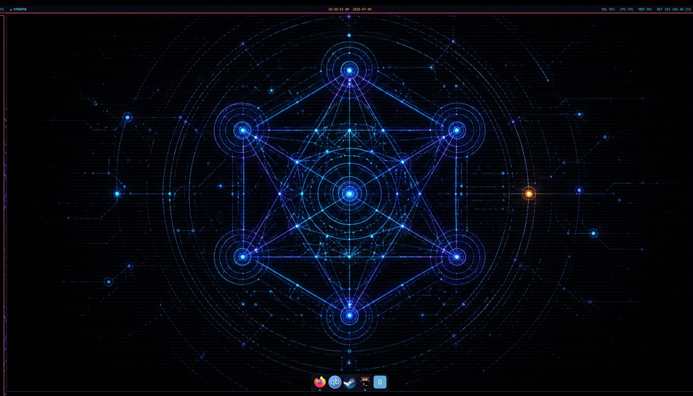

<div align="center">

```
  ███████╗██╗   ██╗███╗   ██╗ █████╗ ██████╗ ███████╗███████╗
  ██╔════╝╚██╗ ██╔╝████╗  ██║██╔══██╗██╔══██╗██╔════╝██╔════╝
  ███████╗ ╚████╔╝ ██╔██╗ ██║███████║██████╔╝███████╗█████╗
  ╚════██║  ╚██╔╝  ██║╚██╗██║██╔══██║██╔═══╝ ╚════██║██╔══╝
  ███████║   ██║   ██║ ╚████║██║  ██║██║     ███████║███████╗
  ╚══════╝   ╚═╝   ╚═╝  ╚═══╝╚═╝  ╚═╝╚═╝     ╚══════╝╚══════╝
```

# SynapseOS

**Where the kernel thinks.**

An Arch-based operating system with a local LLM wired into the system layer — not bolted on top.

[](https://github.com/velle999/SYNAPSE/actions/workflows/build.yml)
[](https://github.com/velle999/SYNAPSE/releases/latest)
[](#license)




<sub><i>synui, the wlroots compositor: waybar status bar, auto-hiding dock, CRT post-process filters.</i></sub>

</div>

---

SynapseOS runs a local LLM daemon as a system service and lets the rest of the
system talk to it over a Unix socket: the shell, the compositor, the security
monitor, the network filter, and a kernel module that exports syscall telemetry
and AI scheduling hints through sysfs. No network calls, no API keys — the model
lives on the machine.

It boots to `synsh`, a shell where you can type a command or just say what you
want, and into `synui`, a wlroots compositor that knows the AI daemon exists.

> **Status: alpha.** Version 0.1.x. This is a real, actively developed system —
> the author daily-drives it — but it is early, moves fast, and will break.
> Try it in a VM before you give it a disk.

---

## Quick start

Grab the latest ISO from [Releases](https://github.com/velle999/SYNAPSE/releases/latest)
and boot it. The default ISO embeds Mistral 7B Instruct (Q4_K_M, ~4.1 GB), so
the AI is live on first boot with nothing to configure.

To take it for a spin without touching hardware:

```bash
git clone https://github.com/velle999/SYNAPSE.git && cd SYNAPSE
QEMU_RAM=8G ./archiso/build_scripts/qemu-test.sh   # auto-detects the newest ISO
```

The script uses KVM when available, boots UEFI via OVMF (falling back to BIOS),
and attaches a persistent 20 GB test disk. Give it 8 GB+ of RAM when the model
is embedded. Kernel and boot output are mirrored to the serial console —
`View → serial0` in the QEMU window.

---

## Components

Each lives in its own directory with its own `PKGBUILD`.

| Component | What it does |
|---|---|
| **`synapd`** | Local LLM inference daemon (llama.cpp). Owns the model; serves every other component over a Unix socket. |
| **`synsh`** | AI-native shell. Type naturally, or use it as a normal shell. |
| **`synui`** | Wayland compositor on wlroots 0.19 — tiling and monocle layouts, per-output workspaces, XWayland, layer-shell. See [`synui/ROADMAP.md`](synui/ROADMAP.md). |
| **`synguard`** | Security monitor. Classifies syscall events, scores threats, publishes verdicts on a feed that `synui` subscribes to. |
| **`synnet`** | Network policy daemon with nftables integration. |
| **`synapse_kmod`** | Kernel module (DKMS). Syscall monitoring and AI scheduling hints, exposed via sysfs. |

### Apps

| App | What it does |
|---|---|
| **`vibe`** | Local AI coding assistant — an agentic read/write/edit/bash/grep loop. Reuses the model already resident in `synapd` (no second model, no extra VRAM), and confirms before destructive tools. `vibe` in a terminal; `VIBE_BACKEND=ollama` to swap backends. |
| **`chibi`** | Voice-interactive AI companion with a security-sentinel aspect over `synguard`'s verdict feed. See the [Chibi wiki page](https://github.com/velle999/SYNAPSE/wiki/Chibi). |
| **`nexus-chat`**, **`tepris`** | Bundled web apps (Firefox app-mode packages). |

Supporting pieces: `syn-install`, `syn-firstboot`, `syn-model`, `waybar/`
(status bar config), and `archiso/` (install media).

---

## Architecture

```
  User
   │
   ▼
 synsh ─── natural language / commands ──┐
   │                                     │
   ▼                                     │
 synapd  (local LLM — Mistral 7B)        │
   │  inference over SYN socket protocol │
   ├──► synguard      security verdicts ─┤
   ├──► synnet        network policy     │
   └──► synapse_kmod  kernel sysfs       │
            │                            ▼
            ▼                    synui (Wayland)
     /sys/kernel/synapse/
     syscall_log, ai_hints, stats,
     status, config, version
```

---

## The desktop

`synui` is a compositor written for this system rather than adapted to it. It
draws its own display-settings panel, wallpaper picker, and dock; it renders an
optional CRT-style post-process pass; and it holds a live subscription to
`synguard`'s verdict feed and `synapd`'s activity.

Defaults (override in `~/.config/synui/synuirc` or `/etc/synui/synuirc`):

| Key | Action |
|---|---|
| `Super` (tapped alone) | Start menu (the bar's SYNAPSE badge) |
| `Super`+`C` | Control panel — every shortcut, plus the settings, in one place |
| `Super`+`Return` | Open a terminal |
| `Super`+`Space` | Command bar |
| `Super`+`Backspace` | Ask the AI |
| `Super`+`A` | Neural activity overlay |
| `Super`+`D` | Display settings |
| `Super`+`W` | Wallpaper picker |
| `Super`+`E` | Toggle visual effects |
| `Super`+`Escape` | Menu |
| `Super`+`Tab` | Cycle layout |
| `Super`+`Q` / `Super`+`Shift`+`Q` | Close window / quit compositor |
| `Super`+`J` / `Super`+`K` | Focus next / previous |
| `Super`+`H` / `Super`+`Shift`+`L` | Shrink / grow master area |
| `Super`+`F` / `Super`+`M` / `Super`+`N` | Float / maximize / minimize |
| `Super`+`Shift`+`F` | Fullscreen (forces it — for games that only do "borderless") |
| `Super`+`O` / `Super`+`Shift`+`O` | Move window to next / previous monitor |
| `Super`+`P` | Power saving panel |
| `Ctrl`+`Alt`+`Delete` / `Super`+`T` | Task manager (processes, CPU/RAM/GPU) |
| `Super`+`G` | Game mode |
| `Super`+`L` | Lock screen |
| `Print` | Screenshot the monitor you're on |
| `Shift`+`Print` / `Super`+`Shift`+`S` | Screenshot an area (drag it out with slurp) |
| `Ctrl`+`Print` | Screenshot every monitor at once |
| `Super`+`1`–`9` | Switch workspace |
| `Super`+`Shift`+`1`–`9` | Move window to workspace |

Screenshots land in `~/Pictures/Screenshots` *and* on the clipboard, so you can
paste one straight into a chat without opening the file.

---

## Services

Everything starts on boot:

```bash
systemctl status synapd      # AI inference daemon
systemctl status synguard    # security monitor
systemctl status synnet      # network policy
lsmod | grep synapse_kmod    # kernel module
cat /sys/kernel/synapse/status
```

---

## The model

ISOs built with `--no-model` are ~4 GB smaller and fetch the model on first boot
via `syn-firstboot`. You can also drop one in by hand:

```bash
cp your-model.gguf /var/lib/synapd/models/synapse.gguf
systemctl restart synapd

synsh
# ⚡ AI online — type naturally or use shell commands
```

Any GGUF that llama.cpp can load will work; Mistral 7B Instruct is what the
prompts are tuned against.

---

## Building

**Prerequisites** — an Arch (or Arch-based) host with `archiso`, `base-devel`,
`meson`, `ninja`, `wlroots0.19`, `qemu`, and `ovmf`. Budget ~22 GB of free disk
with the embedded model, ~9 GB without.

`archiso/build.sh` runs the whole pipeline: builds llama.cpp (pinned at tag
`b8272`, matching CI), packages every component through its `PKGBUILD` into a
local pacman repo, fetches the model, and invokes `mkarchiso`.

```bash
sudo archiso/build.sh              # full build, GPU auto-detected
sudo archiso/build.sh --no-gpu     # CPU-only llama.cpp — use for QEMU-targeted ISOs
sudo archiso/build.sh --no-model   # slim ISO, model downloaded on first boot
sudo archiso/build.sh --no-clean   # reuse the previous llama.cpp build
```

Output lands in `archiso/out/SynapseOS-<version>-x86_64.iso`.

Package builds run as the `synbuild` user under `/var/tmp`, because they must
live outside `/home` (mode 0700). A failed package build aborts the run
immediately rather than resurfacing later as a confusing pacstrap error.

For the inner-loop, skip the ISO entirely:

```bash
bash build-all.sh   # builds every component against llama-staging/usr/
```

### Cutting a release

Bump **`iso_version`** in `archiso/profiledef.sh` and nothing else — in
particular, leave `SYNAPSEOS_VERSION` in `archiso/build.sh` alone, as it tracks
the component series rather than the image. Then run `archiso/publish-release.sh`.

---

## Protocol

`synsh`, `synui`, `synguard`, `synnet`, and the kernel module all speak to
`synapd` over a Unix socket using a fixed 28-byte binary header
([`synapd/include/synapd.h`](synapd/include/synapd.h)):

```c
#pragma pack(push, 1)
typedef struct {
    uint32_t magic;        // 0x53594E41 "SYNA"
    uint8_t  version;      // SYNAPD_PROTOCOL_VER
    uint8_t  msg_type;     // QUERY, SYSCALL_EVENT, SCHED_HINT, CONTEXT_PUSH/GET,
                           // STATUS, RELOAD, SHUTDOWN; responses OR SYN_MSG_RESPONSE
    uint16_t flags;
    uint32_t payload_len;  // bytes following this header, max 1 MiB
    uint32_t request_id;   // echoed in the response
    uint32_t client_pid;   // sender PID, for privilege checks
    uint64_t timestamp_ns; // CLOCK_MONOTONIC_RAW
} syn_msg_header_t;        // 28 bytes
#pragma pack(pop)
```

---

## License

GPLv2 — the SynapseOS Project.
