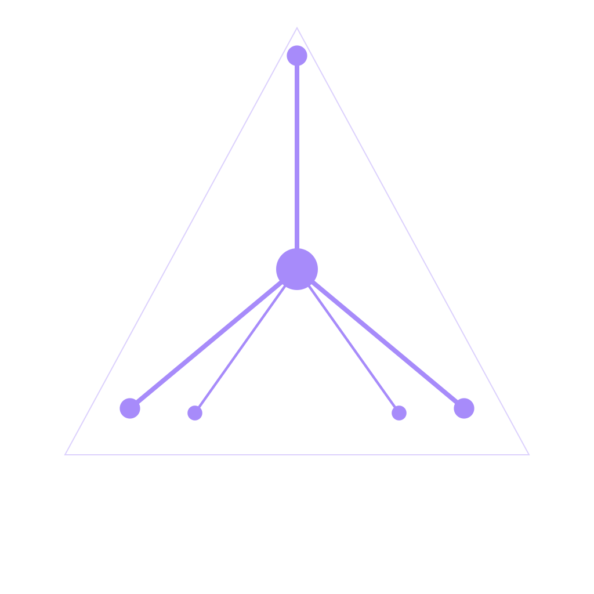
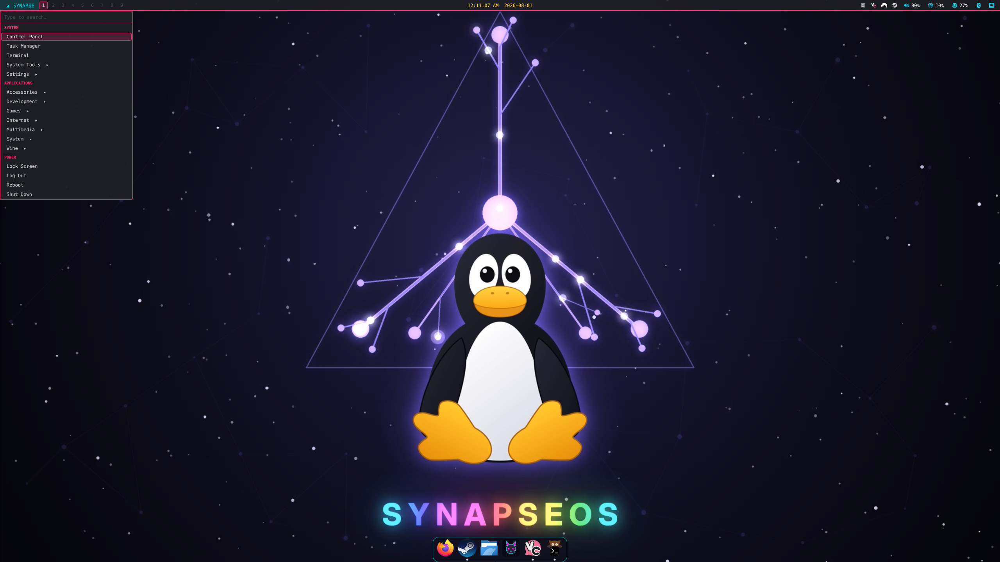
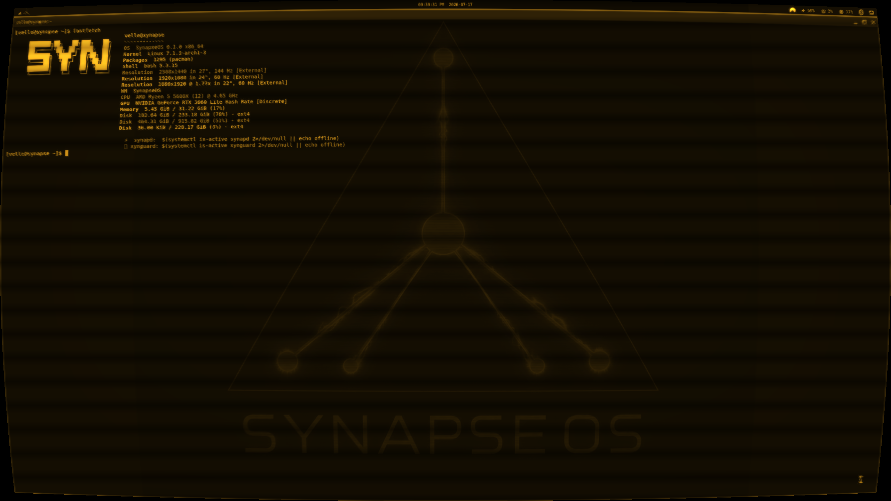

<div align="center">

<!-- The dendrite mark, straight from the vector source rather than a raster
     copy of it, so this cannot drift from what synui and the boot splash draw.
     Every stroke is #a78bfa on transparency -- no background rect -- so it
     reads on GitHub's light and dark themes alike.

     Not the ASCII mark that /etc/issue and the installers print: GitHub cannot
     centre a code block. align="center" is inherited by the heading and the
     badges below but not by <pre>, which is why the art sat left of everything
     under it. An  is inline, so it centres, and it does not scroll
     sideways on a phone. -->


# SynapseOS

**Where the kernel thinks.**

An Arch-based operating system with a local LLM wired into the system layer — not bolted on top.

[](https://github.com/velle999/SYNAPSE/actions/workflows/build.yml)
[](https://github.com/velle999/SYNAPSE/releases/latest)
[](#license)




<sub><i>synui, the wlroots compositor: native quickshell bar, application menu, auto-hiding dock.</i></sub>


<sub><i>CRT post-process filters example in amber phosphor.</i></sub>
</div>

---

SynapseOS runs a local LLM daemon as a system service and lets the rest of the
system talk to it over a Unix socket: the shell, the compositor, the security
monitor, the network filter, and a kernel module that exports syscall telemetry
and AI scheduling hints through sysfs. No network calls, no API keys — the model
lives on the machine.

It boots to `synsh`, a shell where you can type a command or just say what you
want, and into `synui`, a wlroots compositor that knows the AI daemon exists.

> **Status: alpha.** Version 0.2.x. This is a real, actively developed system —
> the author daily-drives it — but it is early, moves fast, and will break.
> Try it in a VM before you give it a disk.

---

## Quick start

Grab the latest ISO from [Releases](https://github.com/velle999/SYNAPSE/releases/latest)
and boot it. The default ISO embeds Mistral 7B Instruct (Q4_K_M, ~4.1 GB), so
the AI is live on first boot with nothing to configure.

To take it for a spin without touching hardware:

```bash
git clone https://github.com/velle999/SYNAPSE.git && cd SYNAPSE
QEMU_RAM=8G ./archiso/build_scripts/qemu-test.sh   # auto-detects the newest ISO
```

The script uses KVM when available, boots UEFI via OVMF (falling back to BIOS),
and attaches a persistent 20 GB test disk. Give it 8 GB+ of RAM when the model
is embedded. Kernel and boot output are mirrored to the serial console —
`View → serial0` in the QEMU window.

When you are ready to install, `syn-install` from the live session offers a
whole-disk install with optional **LUKS2 full-disk encryption**, or — on UEFI,
where the disk already holds another OS — a non-destructive **dual-boot** install
into existing free space, reusing the machine's ESP.

---

## Staying up to date

An installed system needs **two** update commands, because they cover different
halves of it:

```bash
synpkg upgrade       # Arch: kernel, Mesa, Qt, everything from the Arch repos
syn-update check     # SynapseOS: synui, synapd, synguard and the rest
syn-update apply     # rebuild what changed and install it
```

`synpkg upgrade` is the same libalpm engine `pacman -Syu` is, and `pacman -Syu`
still works — `synpkg` refreshes the databases first either way, so neither can
leave you with the partial upgrade a bare `-Sy` produces.

Installing software is `synpkg` too — the **Software Manager** in the start
menu is its GUI. It is one front-end over five places software comes from, and
each has its own tab so a row is never ambiguous about where it came from or
what will install it:

| Tab | Source | Installed by |
|---|---|---|
| **Repositories** | Arch's `core`/`extra`/`multilib` and SynapseOS's own | `pacman`, signed binaries |
| **AUR** | the Arch User Repository | `makepkg`, built from source in a terminal so you can read the `PKGBUILD` first |
| **Flathub** | sandboxed applications with their own runtimes | `flatpak`, with its own permission prompts |
| **Arsenal** | ~5000 BlackArch security tools, by category | `pacman`, once the repo is enabled |
| **SynapseOS** | this system's own components | `syn-update`, which rebuilds from git |

Flathub and BlackArch are **off until you enable them** — `synpkg flatpak
enable-flathub` and `synpkg arsenal enable-repo`, or the buttons the GUI offers
where it says they are off. `synpkg about` reports which sources are actually
wired up on your machine.

`syn-update` clones the project to `/var/lib/synapse-src` and rebuilds only the
components whose `pkgver`/`pkgrel` moved, using `makepkg` — so it needs
`base-devel`, and components are compiled on the target rather than downloaded.
Components with a large prebuilt payload (`synapse-llama`,
`linux-wallpaperengine`, `chibi`) are **reported rather than skipped silently**
and move with an ISO upgrade instead. There is a GUI at **SynapseOS Updates** in
the start menu, distinct from **Update System**, which is Arch.

> **This did not work before 0.2.3.** `syn-install` gave every system a
> `[synapseos]` repository pointing at `/var/cache/synapseos` — a directory
> copied off the ISO at install time that nothing ever wrote to again. `pacman
> -Syu` upgraded all of Arch and could never see a newer `synui`, `synapd` or
> `synguard`, **with no error to notice**. An installed SynapseOS was frozen at
> whatever ISO installed it. If you installed from an older ISO, install
> `syn-update` and run it once.

Full details: **[Updating](https://github.com/velle999/SYNAPSE/wiki/Updating)**.

---

## Components

Each lives in its own directory with its own `PKGBUILD`.

| Component | What it does |
|---|---|
| **`synapd`** | Local LLM inference daemon (llama.cpp). Owns the model; serves every other component over a Unix socket. |
| **`synsh`** | AI-native shell. Type naturally, or use it as a normal shell. |
| **`synui`** | Wayland compositor on wlroots 0.20, rendering through scenefx 0.5 — tiling, spiral, monocle, floating and niri-style scrollable-tiling layouts, per-output workspaces, XWayland, layer-shell, glass/blur/shadows. See [`synui/ROADMAP.md`](synui/ROADMAP.md). |
| **`synguard`** | Security monitor. Classifies syscall events, scores threats, publishes verdicts on a feed that `synui` subscribes to. |
| **`synnet`** | Network policy daemon with nftables integration. |
| **`synapse_kmod`** | Kernel module (DKMS). Syscall monitoring and AI scheduling hints, exposed via sysfs. |
| **`synpkg`** | The package manager — one C binary over `libalpm` covering the Arch repositories, the AUR, Flathub, BlackArch and SynapseOS's own components. CLI, terminal browser (`synpkg tui`) and a quickshell GUI (`synpkg gui`), all reading the same code paths. |
| **`synfiles`** | The file manager, and what a folder opens in. One C binary — tabs, split view, search, trash, undo, archives, drag-and-drop, properties — plus a quickshell window that only renders what `synfiles --rec` prints. No dependency but libc: file types come from shared-mime-info's data, mounting is delegated to udisks2. |

### Apps

| App | What it does |
|---|---|
| **`vibe`** | Local AI coding assistant — an agentic read/write/edit/bash/grep loop. Reuses the model already resident in `synapd` (no second model, no extra VRAM), and confirms before destructive tools. `vibe` in a terminal; `VIBE_BACKEND=ollama` to swap backends. |
| **`chibi`** | Voice-interactive AI companion with a security-sentinel aspect over `synguard`'s verdict feed. See the [Chibi wiki page](https://github.com/velle999/SYNAPSE/wiki/Chibi). |
| **`nexus-chat`**, **`tepris`** | Bundled web apps (Firefox app-mode packages). |

Supporting pieces: `syn-install`, `syn-firstboot`, `syn-model`, `syn-crypt`,
`scenefx/` (the vendored scene-graph fork synui renders through),
`synui/quickshell/` (the bar and the desktop widgets), and `archiso/`
(install media).

---

## Architecture

```
  User
   │
   ▼
 synsh ─── natural language / commands ──┐
   │                                     │
   ▼                                     │
 synapd  (local LLM — Mistral 7B)        │
   │  inference over SYN socket protocol │
   ├──► synguard      security verdicts ─┤
   ├──► synnet        network policy     │
   └──► synapse_kmod  kernel sysfs       │
            │                            ▼
            ▼                    synui (Wayland)
     /sys/kernel/synapse/
     syscall_log, ai_hints, stats,
     status, config, version
```

---

## The desktop

`synui` is a compositor written for this system rather than adapted to it. It
draws its own display-settings panel, wallpaper picker, dock, cursor picker,
sound panel and control panel; it renders glass, blur and shadows through
scenefx plus an optional CRT-style post-process pass; and it holds a live
subscription to `synguard`'s verdict feed and `synapd`'s activity.

The status bar and the desktop widgets are a native [quickshell](https://quickshell.org/)
shell — waybar was replaced in synui pkgrel 154, and the start button and menu
moved into the bar shortly after. Right-clicking the bar's volume module opens a
mixer drawn by the bar itself: output and input devices, and a slider per
application.

**Two shells ship**, and `bar_shell` in synuirc (or Control panel ▸ Desktop ▸
*Bar shell*) picks between them:

| `bar_shell` | What you get |
|---|---|
| `synapse` *(default)* | The bar described above — start menu, tray, mixer, widgets |
| `antiquity` | A radial taskbar, a sidebar and a tarot-card power menu |

**Antiquity is a port of [linux-antiquity](https://github.com/diinki/linux-antiquity)
by [diinki](https://github.com/diinki)** — her design, her QML, and the three
wallpapers the theme was drawn against, used here under the MIT licence
(© 2026 diinki) with her notice kept in the tree as `LICENSE.antiquity`. The two
shells are complete and independent of each other; they disagree about nearly
every visual decision, and nothing is shared between them. Changing `bar_shell`
takes effect at the next login, because synui does not start the bar itself.

The provenance of everything shipped alongside it that we did not draw is
recorded in `quickshell-antiquity/FONTS.md` and `WALLPAPERS.md` — including the
Indian Type Foundry credit clause that Boska, Recia and Quilon carry, and the
three upstream fonts that were **not** redistributable and so were removed.

Defaults (override in `~/.config/synui/synuirc` or `/etc/synui/synuirc`):

| Key | Action |
|---|---|
| `Super` (tapped alone) | Start menu (the bar's SYNAPSE badge) |
| `Super`+`C` | Control panel — every shortcut, plus the settings, in one place |
| `Super`+`/` (or `Super`+`?`) | Shortcut palette — every binding below, searchable; `F2` on a row moves it to another key |
| `Super`+`Return` | Open a terminal |
| `Super`+`Space` | App launcher (rofi, `-show drun`) |
| `Super`+`=` | Command bar — synsh intents and output capture |
| `Super`+`Backspace` | Ask the AI |
| `Super`+`A` | Neural activity overlay |
| `Super`+`D` | Display settings |
| `Super`+`W` / `Super`+`Shift`+`W` | Wallpaper picker (`Tab` scopes it to one monitor) / reload the wallpaper |
| `Super`+`E` | Visual effects — CRT filter strengths, and (`Tab`) window effects: corners, shadow, blur, translucency |
| `Super`+`T` | Theme manager (SYNAPSE / Dark / XP / 95, plus six riced palettes) |
| `Super`+`Shift`+`T` | Tile this desktop — switches to the tiling layout from wherever you are and drags every dragged, snapped, floated or maximized window back into it |
| `Super`+`Shift`+`Y` | Cascade this desktop — small overlapping cards dealt into a grid of piles, each card at most a third of the screen wide and half of it tall |
| `Super`+`Shift`+`G` | Arrange the desktop *without* leaving the layout you are on — puts every window you have dragged back where the layout wants it. On a floating desktop that is the inset grid ("G for grid"); this is the one tidy-up that leaves a floating desktop floating |
| `Super`+`Shift`+`P` | Cursor theme picker ("P for pointer") |
| `Super`+`Shift`+`X` | Crop an image ("X for cut") — opens on your recent images from Pictures, Wallpapers and Downloads |
| `Super`+`S` | Event sounds — all silent until you turn them on |
| `Super`+`Shift`+`A` | Desktop widgets (visualiser, sysmon, clock, quick-launch, post-it) |
| `Super`+`Escape` | Menu |
| `Super`+`Tab` | Cycle layout |
| `Alt`+`Tab` / `Alt`+`Shift`+`Tab` | Switch window. By default this is **mission control** — every window on this desktop at once, and the desktops along the bottom; hold `Alt`, tap `Tab` to walk the tiles, let go to pick. `alt_tab_style = switcher` (or Control panel ▸ Windows ▸ *Alt+Tab is mission control*) puts the most-recently-used thumbnail strip back |
| `Super`+`Q` / `Super`+`Shift`+`Q` | Close window / quit compositor |
| `Super`+`J` / `Super`+`K` | Focus next / previous |
| `Super`+`Shift`+`J` / `Super`+`Shift`+`K` | Move window down / up the stack |
| `Super`+`H` / `Super`+`Shift`+`L` | Shrink / grow master area (also a niri column's width) |
| `Super`+`,` / `Super`+`.` | niri layout: pull the window into the column on its left / push it back out into its own column. No-ops on the other five layouts |
| `Super`+`F` / `Super`+`M` / `Super`+`N` | Float / maximize / minimize |
| `Super`+`Shift`+`N` | Restore a minimized window |
| `Super`+`Shift`+`F` | Fullscreen (forces it — for games that only do "borderless") |
| `Super`+`Shift`+`D` | Show/hide titlebars |
| `Super`+`O` / `Super`+`Shift`+`O` | Move window to next / previous monitor |
| `Super`+`P` | Power saving panel |
| `Ctrl`+`Alt`+`Delete` | Task manager (processes, CPU/RAM/GPU) |
| `Super`+`G` | Game mode |
| `Super`+`L` | Lock screen |
| `Super`+`B` | Bluetooth |
| `Super`+`Shift`+`B` | Night light (blue-light filter) |
| `Super`+`I` | Network / Wi-Fi |
| `Super`+`V` | Clipboard history |
| `Super`+`semicolon` | Emoji picker — type to search, `Tab` for categories, `Enter` inserts |
| `Super`+`X` | Calculator — type a whole expression (`(1440-32)*0.8`), not a four-function chain. `pi`, `e`, `ans` and `sqrt`/`ln`/`log`/`sin`… all work, `Up`/`Down` recall the tape, `Ctrl`+`C` copies the answer |
| `Super`+`R` | News (Hacker News, Arch, LWN, Phoronix, …) |
| `Super`+`Shift`+`R` | Start/stop screen recording |
| `Super`+`Shift`+`C` | Cat mode |
| `Print` | Screenshot the monitor you're on |
| `Shift`+`Print` / `Super`+`Shift`+`S` | Screenshot an area (drag it out with slurp) |
| `Ctrl`+`Print` | Screenshot every monitor at once |
| Volume keys | Raise / lower / mute (also the USB volume knob) |
| Brightness keys | Screen brightness up / down |
| `Super`+`1`–`9` | Switch workspace |
| `Super`+`Shift`+`1`–`9` | Move window to workspace |

`Super`+`Space` and `Super`+`=` swap with one line — `super_space = cmdbar`
puts the command bar back on Space and moves rofi to `=`. A `bind =` of your
own on either key wins over the swap, which then becomes a logged no-op rather
than fighting your config file.

Rebind anything with a `bind = <combo> <action> [arg]` line in `synuirc` —
**whitespace between the combo and the action, no comma**:

```
bind = super+shift+e spawn wofi --show drun
bind = super+ctrl+3 movews 3
```

A bind on a digit also answers to that digit on the numpad. A duplicate combo
is not a conflict you will notice — the first match wins, so the older binding
silently goes dead; synui logs `DUPLICATE default bind` at startup for exactly
that reason.

Screenshots land in `~/Pictures/Screenshots` *and* on the clipboard, so you can
paste one straight into a chat without opening the file.

Screen recordings land in `~/Videos`, at a constant 60 fps. That detail matters
more than it sounds: a recorder that grabs a frame only when the screen changes
writes a file with no real frame rate, and while it plays perfectly, every video
editor has to conform it on import and drops frames doing so. Recording at a
fixed rate costs nothing — on a high-refresh screen it is actually the smaller
file, because damage-driven capture runs *faster* than 60 whenever anything
moves. `SYNUI_RECORD_FPS` changes the rate if you want the display's own.

Editing one is a separate problem, and not one SynapseOS can solve outright: the
free edition of DaVinci Resolve on Linux decodes neither H.264 nor AAC, so an
ordinary recording imports as media offline however many codecs are installed.
That is a licensing limit inside Resolve, not a missing package. There are two
ways round it — convert afterwards with `syn resolve transcode <file>`, which
writes a DNxHR `.mov` beside the original, or record straight to that format
with **Control panel ▸ Sound ▸ Record for editing**. The second skips a lossy
generation but costs roughly 1 GB a minute against a few hundred KB for an
ordinary take, so it is off by default and the panel row says the rate out loud.

### Files

A folder opens in **SYNAPSE Files** (`synfiles`) — the system's own file
manager, built in the same shape as `synpkg`: a C binary that does the work and
prints records, and a quickshell window that only renders them. Nothing in the
QML knows how to stat a file. It replaced Dolphin as the default in August 2026;
Dolphin is still installed, still works, and is one command away.

Tabs, a split view (`F3`), Icons / Compact / Details, thumbnails, a folder tree,
pinned places, recent files, mounted volumes with fill meters, search that walks
the tree (`Ctrl`+`F`), archives, and drag-and-drop — into another window, onto
the desktop, or out to any other application.

Two things are worth saying out loud because they are the whole design:

- **Delete means the trash.** The XDG trash, so what Dolphin or Nautilus put
  there is what you see, and restoring puts a file back where it came from. The
  permanent one is `synfiles delete --yes` and no key or click reaches it.
- **Anything that changed files can be undone** — `Ctrl`+`Z`, or the chip in the
  toolbar that says what it would reverse. A move of six files undoes as one
  thing. Undo of a *copy* trashes the copies rather than unlinking them: undo
  must never be a shorter road to losing work than delete is.

The right-click menu inherits synui's own service menus — Extract, Crop, Mount
ISO, Run with Wine, Set as Wallpaper — because both file managers read the same
`kio/servicemenus` files. Write a helper once and it appears in both.

**Properties** (`Alt`+`Enter`) is a panel over `synfiles info`, so the dialog and
the command print the same list by construction — including **resolution** for
images and video. Images, MP4 and MOV are read in-tree by their magic bytes, not
their extension: a photo saved as `.txt` still reports its size. Matroska, WebM
and AVI are handed to `ffprobe` if it is installed, and simply show no
resolution row if it is not.

```bash
synfiles gui ~/Downloads       # the window
synfiles find . --name=iso     # or --content=, bounded, never follows a symlink
synfiles info photo.jpg        # what the properties pane shows
synfiles undo list             # what Ctrl+Z would reverse
```

Prefer Dolphin? One command, and it outranks ours because it lands in your own
config:

```bash
xdg-mime default org.kde.dolphin.desktop inode/directory
```

### Fingerprint unlock

The lock screen (`Super`+`L`) takes a fingerprint beside the password. Both are
live at once — type over a reader that is still waiting, and whichever answers
first unlocks. Nothing ships enabled on the hardware side, so a reader needs two
things: the `fprintd` package (an optdepend, not a dependency — it would start a
D-Bus service on every desktop that has no reader) and at least one **enrolled**
finger.

```bash
sudo pacman -S fprintd     # the reader daemon
fprintd-enroll             # as YOUR user, not root — swipe until it says "enroll-completed"
fprintd-list "$USER"       # confirm the print is there
```

`fprintd-enroll -f right-index-finger` picks a specific finger; run it once per
finger you want. Enroll as the user you log in as — prints are stored per
account, and one enrolled as root will never unlock your session.

Then lock with `Super`+`L`: a row under the clock relays the reader's own
prompts ("Place your finger on the reader"). If it says nothing at all, the
helper found no reader, no `fprintd`, or no enrolled print, and the lock quietly
stops asking for the rest of that lock — your password still works, as it does
in every other case. Five rejected swipes retire the reader for that lock too;
that is a bound on guessing, not a lockout.

Turn it off in **Control panel ▸ Power ▸ Unlock with fingerprint**, or with
`lock_fingerprint = off` in `synuirc`. It is on by default and costs a machine
without a reader one extra fork per lock and no visible change.

### Making it yours

Themes, cursors and sounds all have a panel *and* a command-line tool, and both
write the same state — so whichever you reach for, there is one place a setting
can be wrong.

```bash
synui-cursor install ~/Downloads/some-theme.tar.gz   # then: synui-cursor set <name>
synui-sound install ~/Downloads/some-sounds.tar.gz   # then: synui-sound all on
synui-widgets sysmon on                              # desktop widgets, off by default
synui-widgets postit on                              # a note on the desktop; click it to write
```

Event sounds ship **silent** and the desktop widgets ship **off** — an upgrade
should not start making noises or redecorating a desktop nobody asked it to.
The CRT filters are off on a fresh install too; turn them on with `Super`+`E`.
`Tab` on that panel is the second page: rounded corners, drop shadow, backdrop
blur and translucency, each on a knob you turn while watching the window change.

Full detail in the wiki: [Cursor Themes](https://github.com/velle999/SYNAPSE/wiki/Cursor-Themes) ·
[Sound Themes](https://github.com/velle999/SYNAPSE/wiki/Sound-Themes) ·
[The Desktop](https://github.com/velle999/SYNAPSE/wiki/The-Desktop) ·
[Wallpapers](https://github.com/velle999/SYNAPSE/wiki/Wallpapers) ·
[Window Effects](https://github.com/velle999/SYNAPSE/wiki/Window-Effects).

### Wallpapers

`Super`+`W` picks one live: the bundled **Synapse** image, an animated **Matrix**
rain rendered on the GPU, a flat colour, or any PNG/JPEG it finds in `~/Pictures`
and the usual directories. `Tab` scopes the pick to **one monitor** (and back to
all of them), `m` cycles the scaling mode — `fill`, `fit`, `stretch`, `center`,
`tile`. The same thing from `synuirc`:

```ini
wallpaper             = matrix
wallpaper_output      = HDMI-A-1 ~/Pictures/ultrawide.jpg
wallpaper_output_mode = HDMI-A-1 fit
```

A pick writes `~/.config/synui/wallpaper.state`, which deliberately overrides
those keys — delete that file to hand control back to `synuirc`.

**Steam Workshop wallpapers** work too, through the `linux-wallpaperengine`
package (built from `linux-wallpaperengine-pkg/`), **on the ISO since 0.2.1** —
nothing to install. It still needs Steam with Wallpaper Engine installed for its
asset tree, which is not redistributable and so stays where Steam put it.
Subscribed wallpapers show up in the `Super`+`W` picker, and
**`synui-wpengine`** is the command-line half:

```bash
synui-wpengine list                # id, type, title of every subscription
synui-wpengine set <id> [output]   # apply and persist (default: every monitor)
synui-wpengine off [output]        # hand the background back to synui
synui-wpengine restore             # re-apply the saved state
synui-wpengine status              # what is running, and what is saved
```

Scene and video wallpapers render; **web ones come back black** — an upstream bug
in the renderer's CEF path. Steam's own Wallpaper Engine can never apply a
wallpaper here, Proton or not: it paints into a Windows desktop window that does
not exist on Wayland.

> The renderer cannot rebuild a layer surface it has lost, so a suspend used to
> leave it running and painting nothing. synui re-runs `synui-wpengine restore`
> on resume and after a monitor comes back (pkgrel 196).

### Gaming

Running a 7B model as a system service means something has to give when a game
starts — it holds around 4 GB of VRAM and a pile of worker threads.

**Game mode** (`Super`+`G`) is that negotiation. A fullscreen XWayland client is
the signal (Steam, Proton/Wine and native X11 games all present that way, while
desktop apps are Wayland-native and never match), and while one is up synui stops
`synapd` to hand over the VRAM and holds off the idle stages — a gamepad is not a
seat input device, so without that the screen blanks mid-game. Everything is
restored on exit, including if synui itself dies. Firefox and the bundled apps
are excluded, so going fullscreen on a video does not stop the AI.

**`synui-game-run`** is the other half, for launch time — `gamemoderun`, the
MangoHud overlay, and optionally gamescope:

```bash
synui-game-run -- ./game.x86_64          # or as a Steam launch option:
synui-game-run -- %command%
```

Every wrapper is optional and a missing tool is dropped rather than fatal.
`gamescope` and `wine` ship on the ISO; `mangohud` and `gamemode` are optdepends.
The overlay is loaded but hidden — **`Shift_R`+`F12`** toggles it.

> `MANGOHUD=1` only hooks Vulkan. An OpenGL game needs the wrapper, which is the
> usual reason the overlay "doesn't work".

See [Gaming](https://github.com/velle999/SYNAPSE/wiki/Gaming) for the settings,
the exclusion list, and the fullscreen/monitor traps.

---

## Services

Everything starts on boot:

```bash
systemctl status synapd      # AI inference daemon
systemctl status synguard    # security monitor
systemctl status synnet      # network policy
lsmod | grep synapse_kmod    # kernel module
cat /sys/kernel/synapse/status
```

---

## Commands

### Command-line tools

Every tool is prefixed `syn` and self-documents with `--help` (or `help`).

| Command | What it does |
|---|---|
| `syn` | Top-level CLI — `syn status`, `syn info`, `syn model/net/guard/nix …`, `syn shell`, `syn ui`, `syn install` |
| `syn nix` | The optional Nix layer — `apply`, `build`, `update`, `facts`, `edit`, `rollback`, `init`. See [Declarative user environment](#declarative-user-environment-nix) |
| `syn resolve` | DaVinci Resolve support — `doctor` (what is missing), `setup` (OpenCL runtime + launch environment), `install`, `transcode` (footage the free edition can read), `launch` |
| `synsh` | Natural-language shell — type plain English or normal commands; `--no-ai` for pure shell, `--intent-check` to test an intent |
| `syn-model` | Model manager — `download [mistral-7b\|phi3\|tiny]`, `list`, `status`, `remove` |
| `syn-install` | Install SynapseOS to disk (the live-ISO installer) |
| `synpkg` | The package manager — `search`, `install`, `remove`, `upgrade`, `updates`, `installed`, `orphans`, `info`, `status`, `about`. Other sources: `synpkg aur …`, `synpkg flatpak …`, `synpkg arsenal …`, `synpkg system …`. `synpkg tui` browses in the terminal, `synpkg gui [tab]` opens the window |
| `syn-update` | Update the SynapseOS components on an installed system — `check` (default, read-only), `apply`, `status`. Complements `synpkg upgrade`, which covers Arch; see [Staying up to date](#staying-up-to-date) |
| `synfiles` | The file manager — `list`, `info`, `find`, `trash`, `copy`, `move`, `rename`, `mkdir`, `compress`, `undo`, `places`, `recent`, `volumes`, `mount`. `synfiles gui [dir]` opens the window; `--rec` prints the records the window parses. See [Files](#files) |
| `synctl` | Talk to the running `synui` compositor over its control socket — `synctl clients`, `workspaces`, `outputs`, `activewindow`, `dispatch <action> [arg]` |
| `syn-crypt` | Manage LUKS2 disk encryption — `status`, `add-key`, `change-key`, `remove-key`, `backup-header` |
| `syn-secureboot` | Secure Boot status and key enrollment (checks for real firmware Setup Mode first) |
| `synui-ai-backend` | Switch `synapd`'s inference device — `gpu` / `cpu` / `off` / `toggle` / `status` (drives the "AI backend" row; see below) |
| `synapd` / `synguard` / `synnet` / `synui` | The daemons and compositor themselves — normally started by systemd, not by hand |

Desktop helpers, each the command-line half of a `synui` panel:
`synui-sound`, `synui-cursor`, `synui-widgets`, `synui-apply-theme`,
`synui-screenshot`, `synui-record`, `synui-game-run`, `synui-iso-mount`.
`synui-wpengine` (Workshop wallpapers) is the one that ships with the
`linux-wallpaperengine` package rather than with `synui` — both are on the ISO
as of 0.2.1.

### Privileged desktop actions

`synui` runs as the **session user** (under a greetd session it is not root), and
the target has **no polkit agent** to prompt for a password. So the handful of
menu/desktop actions that genuinely need root are granted passwordless through
tightly-scoped `/etc/sudoers.d` rules (written by `syn-install`). These are the
*only* commands `%wheel` may run without a password — each helper self-escalates
with `sudo -n`:

| Command | Rule file | Triggered by |
|---|---|---|
| `sudo -n systemctl reboot` · `poweroff` | `power-menu` | Start-menu Reboot / Shut Down |
| `sudo -n systemctl stop synapd` · `start synapd` | `synapd-gamemode` | Game mode (`Super`+`G`) frees the GPU |
| `sudo -n synui-ai-backend gpu\|cpu\|off\|toggle` | `synapd-backend` | "AI backend" row (control panel / `Super`+`Escape`) |

Anything else still prompts for a password (`%wheel ALL=(ALL:ALL) ALL`). When
`synui` instead runs as root via `synui.service`, the `sudo -n` re-exec is a
no-op — the helpers already have the privilege they need.

---

## Declarative user environment (Nix)

Optional, off by default, and opt-in at install time (`Full`, or answer yes in
`Custom`). It adds **Nix + Home Manager** *beside* pacman, not underneath it:
pacman keeps owning the system — compositor, daemons, drivers, the SynapseOS
core — and Nix owns a declarative **user** environment on top.

The configurator is `/etc/synapseos/nix`, owned by your account:

| File | |
|---|---|
| `flake.nix` | inputs, pinned by `flake.lock`. nixpkgs-unstable + the matching home-manager branch |
| `home.nix` | **yours** — packages and dotfiles. `syn nix edit` opens it |
| `facts.nix` | **generated** — what this machine actually is |

`facts.nix` is the bridge. Nix on a foreign distro cannot see what pacman did,
so `syn-nix-facts` probes the installed system and hands the result to the
expressions as `facts`:

```nix
{ system = "x86_64-linux"; gpu = "nvidia"; allowUnfree = true;
  username = "syn"; desktop = "synui";
  want = { steam = true; blackarch = true; wine = true; /* … */ }; }
```

so `home.nix` reacts to the box instead of being hand-edited per box:

```nix
home.packages = with pkgs; [ ripgrep ]
  ++ lib.optionals facts.want.steam    [ protontricks ]
  ++ lib.optionals facts.want.blackarch [ nmap ];
```

The same probe runs at install time (against `/mnt`) and any time afterwards
via `syn nix facts` — one implementation, so the two cannot drift. Add Steam
with pacman a month later, re-run it, and the facts follow.

```
syn nix apply     build the config and activate it
syn nix build     build it without activating
syn nix update    bump flake.lock
syn nix facts     re-derive facts.nix from this machine
syn nix status    daemon, store size, whether the flake is set up
```

### Installing from a profile

Separate from the above, and worth not confusing with it: `facts.nix`
*describes* a machine that exists, while an **install profile** *prescribes*
one that does not yet.

```
syn-install --config profile.nix      # or a plain key=value file
```

Every question the installer asks has a key. **Whatever the profile leaves out
is still asked at the machine**, so pinning just the disk layout and the
package set is a perfectly good profile — this is not all-or-nothing.

```nix
{
  disk = "vda";
  install_mode = "erase";
  confirm_erase = true;
  filesystem = "btrfs";
  bootloader = "limine";
  snapshots  = true;
  preset = "custom";
  want = { steam = false; blackarch = true; nix = true; };
  username = "syn";
  desktop  = "synui";
  timezone = "America/Chicago";
}
```

`/usr/share/syn/nix/profile-example.nix` documents every key. Two properties
are deliberate:

- **Keys are semantic, never menu positions.** `filesystem = "btrfs"`, not
  `filesystem = 2` — a number means whatever that row is on the day you
  install, and menus grow entries. The mapping happens inside `answer`, so no
  decision table in the installer was rewritten for any of this.
- **A key that answers nothing is reported by name** at the end of the run.
  `bootlaoder = "limine"` is not a syntax error, it is silence, and silence is
  how preseeding usually fails — you find out when the machine boots the wrong
  loader.

The destructive confirmations (`confirm_erase`, `confirm_alongside`,
`confirm_format`) are each their own key on purpose: an unattended install that
erases a disk should have said so in writing. Leave them out and the installer
stops and asks, which is the right answer for a profile that was not meant to
run unattended.

The ISO ships `nix` so `--config profile.nix` evaluates in place. On a medium
without it, render first — the installer says as much rather than failing
obscurely:

```
syn nix profile profile.nix > install.conf
syn-install --config install.conf
```

**The installer builds nothing.** Setting up the config is seconds; realising
it is a multi-gigabyte fetch from `cache.nixos.org`, and the nix daemon is not
running in the installer's chroot anyway. So a fresh install leaves the layer
ready and the first `syn nix apply` — as your user, after a reboot — is what
downloads.

Two things worth knowing:

- **Do not manage `synuirc` from `home.nix`.** Home Manager materialises
  managed files as read-only symlinks into `/nix/store`, but `synui` and
  `synctl` write that file live on every settings change. Declaring it does not
  make it win — it makes the control panel silently revert. Declare packages;
  leave live state to whatever owns it.
- **`/etc/synapseos/nix` is deliberately not a git repo.** Flakes inside a git
  repo copy only tracked files, so a freshly generated `facts.nix` would be
  invisible to evaluation, and nothing in the error would point at git.

---

## The model

ISOs built with `--no-model` are ~4 GB smaller and fetch the model on first boot
via `syn-firstboot`. You can also drop one in by hand:

```bash
cp your-model.gguf /var/lib/synapd/models/synapse.gguf
systemctl restart synapd

synsh
# ⚡ AI online — type naturally or use shell commands
```

Any GGUF that llama.cpp can load will work; Mistral 7B Instruct is what the
prompts are tuned against.

### GPU inference

`synapd` runs on the CPU by default and offloads to the GPU when a matching
`synapse-llama-*` build is installed. The installer picks the right one for your
hardware; you can also switch at any time from the desktop's **AI backend** row
(or `synui-ai-backend gpu`).

| Package | Hardware | Backend | Runtime cost |
|---|---|---|---|
| `synapse-llama` | any | CPU | — (the default) |
| `synapse-llama-cuda` | NVIDIA | CUDA | large (`cuda` ~4.7 GiB) |
| `synapse-llama-vulkan` | AMD / Intel | Vulkan | tiny (loader + mesa ICD) |

The **Vulkan** build is deliberately portable — one package runs on any AMD
(GCN/RDNA/APU) or Intel GPU with no per-card compile, which is why the ISO can
offer it broadly. ROCm/HIP is an opt-in high-performance path for a known AMD
card: build it with `sudo archiso/build.sh --gpu=rocm`.

---

## Building

**Prerequisites** — an Arch (or Arch-based) host with `archiso`, `base-devel`,
`meson`, `ninja`, `wlroots0.20`, `scenefx0.5`, `quickshell`, `qemu`, and `ovmf`.
Budget ~22 GB of free disk with the embedded model, ~9 GB without.

`archiso/build.sh` runs the whole pipeline: builds llama.cpp (pinned at tag
`b8272`, matching CI), packages every component through its `PKGBUILD` into a
local pacman repo, fetches the model, and invokes `mkarchiso`.

```bash
sudo archiso/build.sh              # full build, GPU auto-detected
sudo archiso/build.sh --no-gpu     # CPU-only llama.cpp — use for QEMU-targeted ISOs
sudo archiso/build.sh --gpu=vulkan # AMD/Intel GPU backend (portable; needs shaderc)
sudo archiso/build.sh --gpu=cuda   # NVIDIA GPU backend (needs the cuda toolkit)
sudo archiso/build.sh --no-model   # slim ISO, model downloaded on first boot
sudo archiso/build.sh --no-clean   # reuse the previous llama.cpp build
```

Regardless of the ISO's own backend, a release build **also** packages a GPU
build into the repo when the host has the toolchain — `synapse-llama-cuda` if
`nvcc` is present, `synapse-llama-vulkan` if `glslc` (from `shaderc`) is — so an
installed machine can switch onto its GPU. Add `shaderc` + `vulkan-headers` to
the build host to ship the AMD/Intel package.

Output lands in `archiso/out/SynapseOS-<version>-x86_64.iso`.

Package builds run as the `synbuild` user under `/var/tmp`, because they must
live outside `/home` (mode 0700). A failed package build aborts the run
immediately rather than resurfacing later as a confusing pacstrap error.

For the inner-loop, skip the ISO entirely:

```bash
bash build-all.sh   # builds every component against llama-staging/usr/
```

### Cutting a release

Bump **`iso_version`** in `archiso/profiledef.sh` and nothing else — in
particular, leave `SYNAPSEOS_VERSION` in `archiso/build.sh` alone, as it tracks
the component series rather than the image. Then run `archiso/publish-release.sh`.

---

## Protocol

`synsh`, `synui`, `synguard`, `synnet`, and the kernel module all speak to
`synapd` over a Unix socket using a fixed 28-byte binary header
([`synapd/include/synapd.h`](synapd/include/synapd.h)):

```c
#pragma pack(push, 1)
typedef struct {
    uint32_t magic;        // 0x53594E41 "SYNA"
    uint8_t  version;      // SYNAPD_PROTOCOL_VER
    uint8_t  msg_type;     // QUERY, SYSCALL_EVENT, SCHED_HINT, CONTEXT_PUSH/GET,
                           // STATUS, RELOAD, SHUTDOWN; responses OR SYN_MSG_RESPONSE
    uint16_t flags;
    uint32_t payload_len;  // bytes following this header, max 1 MiB
    uint32_t request_id;   // echoed in the response
    uint32_t client_pid;   // sender PID, for privilege checks
    uint64_t timestamp_ns; // CLOCK_MONOTONIC_RAW
} syn_msg_header_t;        // 28 bytes
#pragma pack(pop)
```

---

## License

SPDX identifiers, per component:

| Scope | License |
|---|---|
| `synapse_kmod` (kernel module) | `GPL-2.0-only` — it links the kernel |
| `synapd`, `synui`, `synsh`, `synguard`, `synnet`, `syn`, `syn-install`, `syn-model`, `syn-update`, `syn-firstboot`, `syn-arsenal`, `synfiles`, `vibe`, `chibi` | `GPL-2.0-or-later` |
| `synpkg` | `GPL-2.0-or-later` — it links `libalpm`, which is, so it can be nothing else |
| `scenefx` (vendored fork), `synapse-llama`, `nexus-chat`, `tepris` | `MIT`, upstream |
| `synui/quickshell-antiquity/` and its three wallpapers | `MIT`, © 2026 [diinki](https://github.com/diinki) — a port of [linux-antiquity](https://github.com/diinki/linux-antiquity); notice kept as `LICENSE.antiquity` |
| Boska, Recia, Quilon (bundled with Antiquity) | © [Indian Type Foundry](https://www.indiantypefoundry.com/), via Fontshare — their licence requires naming the faces and crediting ITF's ownership; `quickshell-antiquity/FONTS.md` is that credit |
| `MaterialSymbolsSharp` (bundled with Antiquity) | `Apache-2.0`, © Google LLC |
| `linux-wallpaperengine` | `GPL-3.0-or-later`, upstream — packaged from [Almamu/linux-wallpaperengine](https://github.com/Almamu/linux-wallpaperengine) at a pinned commit |
| CEF / Chromium (bundled with `linux-wallpaperengine`) | `BSD-3-Clause`, © The Chromium Embedded Framework Authors and © The Chromium Authors — the renderer links `libcef.so` for web wallpapers, so it and its `.pak` data ship with the package |
| `synapse-wallpapers` | `GPL-3.0-or-later` |
| `fetch` (the "About OS" tool) | `ISC`, upstream — packaged from [areofyl/fetch](https://github.com/areofyl/fetch) at a pinned commit, plus two local patches meant for upstream |
| `limine-snapper-sync` | `GPL-3.0`, upstream ([Zesko](https://gitlab.com/Zesko/limine-snapper-sync)) |
| GraalVM CE (linked into `limine-snapper-sync`) | `GPL-2.0-WITH-Classpath-exception-2.0`, © Oracle — it is a `native-image` build, so GraalVM's runtime is statically linked into the shipped binary rather than merely used to compile it |
| `samsung-m2020` (**not shipped** — see below) | `custom:Samsung` — the PKGBUILD is here, the driver is not |

**The Samsung printer driver is not shipped at all.** Samsung's EULA licenses
the Unified Linux Driver binaries "strictly for the personal use" and states
that "No other use, copying or distribution of the SOFTWARE PRODUCT is
permitted", with no redistribution carve-out. So SynapseOS carries the recipe
and not the payload, exactly as the AUR does — `syn printer samsung` downloads
the driver from Samsung onto the machine that will print with it, and installs
the EULA alongside it. The Xpress M2020/M2020W needs this because it is an SPL
device that predates driverless IPP; almost any printer made since roughly 2015
needs no driver at all.

**Wallpaper Engine's own content is not redistributed.** `linux-wallpaperengine`
is an independent renderer; the wallpapers, and Wallpaper Engine's `assets/`
tree that it reads at runtime, stay where Steam put them. Nothing from the Steam
app or the Workshop is on the ISO.

The kernel module is `-only` deliberately: it is a derived work of the kernel,
which is GPL-2.0-only, so relicensing it forward is not ours to do.
