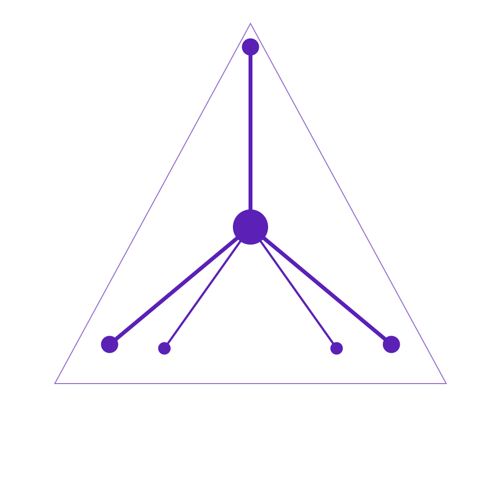
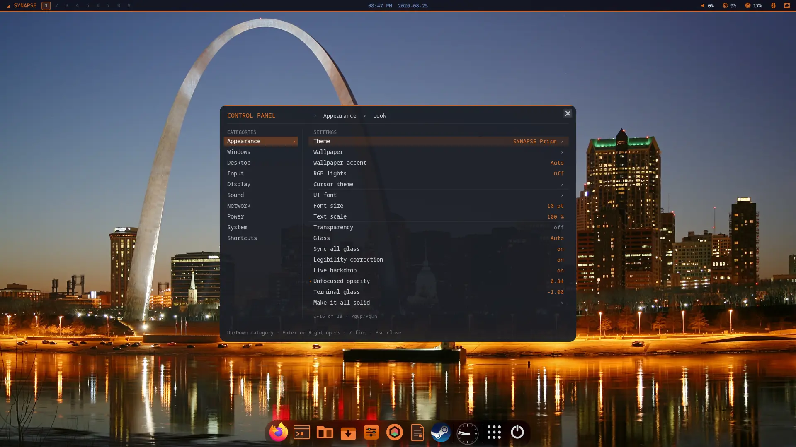
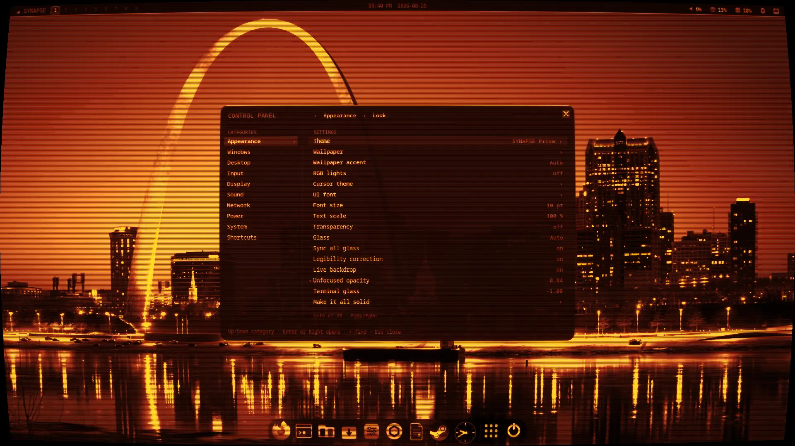

<div align="center">

<!-- The dendrite mark, straight from the vector source rather than a raster
     copy of it, so this cannot drift from what synui and the boot splash draw.
     Every stroke is #a78bfa on transparency -- no background rect -- so it
     reads on GitHub's light and dark themes alike.

     Not the ASCII mark that /etc/issue and the installers print: GitHub cannot
     centre a code block. align="center" is inherited by the heading and the
     badges below but not by <pre>, which is why the art sat left of everything
     under it. An  is inline, so it centres, and it does not scroll
     sideways on a phone. -->
<!-- Two cuts of the same mark, because GitHub renders this page on either
     ground and the brand purple only works on one of them. #a78bfa is drawn for
     dark: it measures about 7:1 on GitHub's #0d1117 and about 2.7:1 on white,
     where it stops being a logo and becomes a smudge. The ink cut (#5b21b6)
     is the reverse — about 9:1 on white, 2.1:1 on dark. branding/logo/README.md
     is the whole table. The <source> is the DARK case; the  is the
     fallback every other renderer takes, so it carries ink, which is also the
     right answer for anything that pastes this into a document. -->
<picture>
  <source media="(prefers-color-scheme: dark)" srcset="synui/data/logo.svg">
  
</picture>

# SynapseOS

**Where the kernel thinks.**

An Arch-based operating system with a local LLM wired into the system layer — not bolted on top.

[](https://github.com/velle999/SYNAPSE/actions/workflows/build.yml)
[](https://github.com/velle999/SYNAPSE/releases/latest)
[](#license)




<sub><i>synui on <b>SYNAPSE Prism</b>, the theme a fresh install boots into. The accent on the bar, the dock and the panel is measured off the wallpaper, live.</i></sub>



<sub><i>The same desktop with the CRT pass on (<code>Super</code>+<code>E</code>) — scanlines, curvature, chromatic aberration and an amber phosphor, applied by the compositor to everything on screen at once.</i></sub>
</div>

---

SynapseOS runs a local LLM daemon as a system service and lets the rest of the
system talk to it over a Unix socket: the shell, the compositor, the security
monitor, the network filter, and a kernel module that exports syscall telemetry
and AI scheduling hints through sysfs. No network calls, no API keys — the model
lives on the machine.

The desktop is `synui`, a wlroots compositor written for this system rather than
adapted to it — one that knows the AI daemon exists.

> **Status: alpha.** Version 0.2.x. This is a real, actively developed system —
> the author daily-drives it — but it is early, moves fast, and will break.
> Try it in a VM before you give it a disk.

---

## Quick start

Grab the latest ISO from [Releases](https://github.com/velle999/SYNAPSE/releases/latest),
[write it to a USB stick](#getting-it-onto-a-usb-stick), and boot it. The live
image asks one question, and it has three answers:

```
1) Install SynapseOS     — right here, in this terminal
2) Install graphically   — starts the desktop first
3) Try the live desktop  — look around; install later
```

Both installers are the same installer: the window is a form that writes an
answer file and hands it to `syn-install --config`, so the partition rules and
the test suite behind them are the one set.

**The ISO carries no AI model** (since 0.2.8) — it was ~4.1 GB of an ~8 GB
image for something the live session could only run on the CPU. The installer
asks which model you want and downloads it onto the machine you are installing
to; Mistral 7B Instruct (Q4_K_M) is the recommendation, and declining is a
first-class answer. Until then `synapd` runs in shell-assist mode, so `syn
status` reporting `model ✗ not installed` on live media is expected rather than
a fault. See [The model](#the-model).

### Getting it onto a USB stick

The download is **split into `.part*` files** — GitHub caps a release asset at
2 GiB and the image is bigger than that — so there is a join step before there
is an ISO. Download every `.part*` file plus `SynapseOS-<ver>-x86_64.iso.sha256`
into one folder. Joining is a plain byte-for-byte concatenation; the checksum is
what tells you it worked.

**Linux / macOS**

```bash
cat SynapseOS-<ver>-x86_64.iso.part* > SynapseOS-<ver>-x86_64.iso
sha256sum -c SynapseOS-<ver>-x86_64.iso.sha256     # shasum -a 256 -c on macOS
sudo dd if=SynapseOS-<ver>-x86_64.iso of=/dev/sdX bs=4M status=progress oflag=sync
```

Check `/dev/sdX` with `lsblk` first, and write to the **disk** (`/dev/sdb`), not
a partition on it (`/dev/sdb1`).

**Windows** — in **Command Prompt**, in the folder you downloaded to:

```bat
copy /b SynapseOS-<ver>-x86_64.iso.part00 + SynapseOS-<ver>-x86_64.iso.part01 SynapseOS-<ver>-x86_64.iso
certutil -hashfile SynapseOS-<ver>-x86_64.iso SHA256
```

Name every part, in order, joined by `+`. `/b` is **not optional**: without it
`copy` runs in text mode and stops at the first `0x1A` byte — a few hundred KB
into the image — leaving a short file, no error message, and a stick that will
not boot. Compare what `certutil` prints against the contents of the `.sha256`
file, or let **PowerShell** do it:

```powershell
(Get-FileHash -Algorithm SHA256 .\SynapseOS-<ver>-x86_64.iso).Hash -eq (((Get-Content .\SynapseOS-<ver>-x86_64.iso.sha256) -split '\s+')[0]).ToUpper()
```

`True` means the join is good. (`Get-FileHash` prints uppercase hex where
`sha256sum` writes lowercase — same bytes, hence the `.ToUpper()`.)

### Check who built it

The checksum proves the download is not corrupt. It does not prove where the
image came from — it is published in the same GitHub release as the ISO, so
anything that could alter one could alter the other. The signature answers that,
and the key to check it against is served from **soslinux.org** rather than from
the release, so the two arrive by different roads.

```bash
curl -O https://soslinux.org/synapseos-release-key.asc
gpg --import synapseos-release-key.asc

gpg --verify SynapseOS-<ver>-x86_64.iso.asc SynapseOS-<ver>-x86_64.iso
```

A good signature names the key it matched. Check that fingerprint against:

```
6548 9EF5 C20D 0BD9 4211  472B ED33 6DB7 952B 609E
```

GnuPG will also say the key is *not certified with a trusted signature*. That is
expected, not a failure: it means you have not told GnuPG you trust this key,
only that the signature matches it. Comparing the fingerprint is what closes
that gap.

Releases from **0.2.9.5** onward are signed; earlier ones are not.

Then write it, with **[Rufus](https://rufus.ie/)** (pick the ISO, START, and
choose **DD Image mode** when asked — this is a hybrid image, and ISO mode
rebuilds boot files it has no reason to get right),
**[balenaEtcher](https://etcher.balena.io/)** (nothing to configure), or
**[Ventoy](https://www.ventoy.net/)** (copy the `.iso` onto an existing Ventoy
stick and pick it from the menu — nothing is erased). **Writing a stick erases
it**; Ventoy is the exception.

Boot the stick from your firmware's boot menu — usually `F12`, `F11`, `Esc` or
`Del` at power-on. Secure Boot has to be off, or SynapseOS enrolled; see
[Secure Boot](https://github.com/velle999/SYNAPSE/wiki/Secure-Boot).

### Trying it in a VM instead

To take it for a spin without touching hardware:

```bash
git clone https://github.com/velle999/SYNAPSE.git && cd SYNAPSE
./archiso/build_scripts/qemu-test.sh                # auto-detects the newest ISO
QEMU_RAM=4G ./archiso/build_scripts/qemu-test.sh    # enough for a modelless ISO
```

The script uses KVM when available, boots UEFI via OVMF (falling back to BIOS),
and attaches a persistent 20 GB test disk. It asks for 8 GB of RAM by default,
which is what a `--with-model` image wants; a stock ISO runs in 4 GB. Kernel and
boot output are mirrored to the serial console — `View → serial0` in the QEMU
window.

### Installing it

When you are ready to install, `syn-install` from the live session offers a
whole-disk install with optional **LUKS2 full-disk encryption**, or — on UEFI,
where the disk already holds another OS — a non-destructive **dual-boot** install
into existing free space, reusing the machine's ESP.

### Choosing what goes on it

Four presets, and the fourth is the interesting one:

| | |
|---|---|
| **Full** | Standard plus Steam, Nix, and a wider software shelf |
| **Standard** | the SynapseOS suite, Firefox, an AI model, Bluetooth, printing, Wine, phone pairing |
| **Minimal** | the core daemons only — no apps, no software, no model |
| **Custom** | tick every package yourself |

**Custom is genuinely every package.** Not "the apps, and the daemons behind a
second question" — one page of checkboxes with all twenty-eight SynapseOS
packages on it, the compositor and the package manager and the file manager
included. What you cannot switch off is only what pacman would pull in anyway:
`synui` hard-depends on `syntty`, `synnet` and `vibe` on `synapd`, `vibe` on
`syn-confine`, `syn-firstboot` on `syn-model`. Those are re-ticked **and named**
before anything is installed, because a checkbox that silently un-ticks itself
is worse than one that was never offered.

```
  SynapseOS packages — everything the system is made of

  [x]  1) SYNAPSE UI    the desktop     [x] 14) Models        fetch AI models
  [x]  2) synapd        the AI daemon   [x] 15) First boot    first-run setup
  [x]  3) synsh         the AI shell    [x] 16) Sandbox       Landlock jail
  …
  Toggle [numbers, 'all', 'none', Enter = accept]:
```

Then five pages of **ordinary software** from the Arch repositories — web and
communication, audio and video, office and graphics, development and admin,
games and launchers. Firefox is ticked by default on every preset but Minimal,
which closes a real gap: an installed SynapseOS used to arrive with **no web
browser at all** unless you happened to pick Full, where Nexus Chat dragged one
in as a dependency.

The graphical installer draws the same table as the same checkboxes, and every
answer is a key in an install profile, so an unattended install picks the same
set:

```nix
preset = "custom";
comp = { synui = true; chibi = false; tepris = false; };
sw   = { firefox = true; vlc = true; docker = true; };
```

`/usr/share/syn/nix/profile-example.nix` documents every key, and a key that
answers nothing is **reported at the end of the install** rather than ignored.

---

## Staying up to date

An installed system needs **two** update commands, because they cover different
halves of it:

```bash
synpkg upgrade       # Arch: kernel, Mesa, Qt, everything from the Arch repos
syn-update check     # SynapseOS: synui, synapd, synguard and the rest
syn-update apply     # rebuild what changed and install it
```

`synpkg upgrade` is the same libalpm engine `pacman -Syu` is, and `pacman -Syu`
still works — `synpkg` refreshes the databases first either way, so neither can
leave you with the partial upgrade a bare `-Sy` produces.

Installing software is `synpkg` too — the **Software Manager** in the start
menu is its GUI. It is one front-end over five places software comes from, and
each has its own tab so a row is never ambiguous about where it came from or
what will install it:

| Tab | Source | Installed by |
|---|---|---|
| **Repositories** | Arch's `core`/`extra`/`multilib` and SynapseOS's own | `pacman`, signed binaries |
| **AUR** | the Arch User Repository | `makepkg`, built from source in a terminal so you can read the `PKGBUILD` first |
| **Flathub** | sandboxed applications with their own runtimes | `flatpak`, with its own permission prompts |
| **Arsenal** | ~5000 BlackArch security tools, by category | `pacman`, once the repo is enabled |
| **SynapseOS** | this system's own components | `syn-update`, which rebuilds from git |

Flathub and BlackArch are **off until you enable them** — `synpkg flatpak
enable-flathub` and `synpkg arsenal enable-repo`, or the buttons the GUI offers
where it says they are off. `synpkg about` reports which sources are actually
wired up on your machine.

You do not have to open it to find something. Type a name into the **start
menu**, or into the command bar, and if nothing installed answers to it the
repositories are asked instead: the menu lists what would provide it, and the
command bar puts the best match one `Return` away. That lookup is local and
ranked so it keeps up with typing — the AUR and Flathub are a network round
trip and are not asked on a keystroke. The last row of either list opens the
Software Manager on **All sources** with the term already in the box, which is
where the wider question gets answered.

A one-key install is only offered for a package actually *named* after what you
typed. Something whose description merely mentions the word is listed, never
armed.

`syn-update` clones the project to `/var/lib/synapse-src` and rebuilds only the
components whose `pkgver`/`pkgrel` moved, using `makepkg` — so it needs
`base-devel`, and components are compiled on the target rather than downloaded.
Components with a large prebuilt payload (`synapse-llama`,
`linux-wallpaperengine`, `chibi`) are **reported rather than skipped silently**
and move with an ISO upgrade instead. There is a GUI at **SynapseOS Updates** in
the start menu, distinct from **Update System**, which is Arch.

**You do not have to remember to check.** A systemd *user* timer runs
`syn-update ping` — the same check, quietly, with the answer written to a small
file instead of a report — and the bar grows an indicator showing how many
updates are waiting, with one click to the Updates window. It is invisible when
the machine is current, because a row that reads "0 updates" all day is a row
nobody reads on the day it says something else.

```bash
syn-update ping --every 6h    # 30m, 12h, 1d, 1week — systemd's own syntax
syn-update ping --off         # stop checking
syn-update ping               # check right now
```

⚠ **Those are two different switches, deliberately.** `ping --off` stops the
machine *asking upstream* — it is about network traffic. Hiding the bar
indicator is furniture, and lives with the rest of the bar's furniture: right-
click the bar ▸ **Update notifier**, per monitor, beside the clock and the tray.
Neither is a copy of the other.

**Right-click the indicator** for the things you would otherwise open a terminal
to do: **Open Updates**, **Check now** (with how long ago the last check was),
**Apply in a terminal**, and **Held back** with the count of packages you have
told `synpkg` to ignore. A row that has nothing to act on is greyed rather than
hidden, so the menu is the same shape every time you open it.

**`syn-update apply` clears the indicator itself.** It re-checks upstream on its
way out and rewrites the pending count, so the badge goes away when the machine
is current instead of waiting for the next timer tick to notice the work you
just did.

The interval is stored as a systemd drop-in under `~/.config/systemd/user`,
never in the shipped unit — `/usr/lib` belongs to the package, and this
particular package updates itself often enough that an interval written there
would quietly revert.

> **This did not work before 0.2.3.** `syn-install` gave every system a
> `[synapseos]` repository pointing at `/var/cache/synapseos` — a directory
> copied off the ISO at install time that nothing ever wrote to again. `pacman
> -Syu` upgraded all of Arch and could never see a newer `synui`, `synapd` or
> `synguard`, **with no error to notice**. An installed SynapseOS was frozen at
> whatever ISO installed it. If you installed from an older ISO, install
> `syn-update` and run it once.

Full details: **[Updating](https://github.com/velle999/SYNAPSE/wiki/Updating)**.

---

## Components

Each lives in its own directory with its own `PKGBUILD`.

| Component | What it does |
|---|---|
| **`synapd`** | Local LLM inference daemon (llama.cpp). Owns the model; serves every other component over a Unix socket. |
| **`synsh`** | AI-native shell. Type naturally, or use it as a normal shell. |
| **`synui`** | Wayland compositor on wlroots 0.20, rendering through scenefx 0.5 — tiling, spiral, monocle, floating and niri-style scrollable-tiling layouts, per-output workspaces, XWayland, layer-shell, glass/blur/shadows. See [`synui/ROADMAP.md`](synui/ROADMAP.md). |
| **`synguard`** | Security monitor. Classifies syscall events, scores threats, publishes verdicts on a feed that `synui` subscribes to. |
| **`synnet`** | Network policy daemon with nftables integration. |
| **`synapse_kmod`** | Kernel module (DKMS). Syscall monitoring and AI scheduling hints, exposed via sysfs. |
| **`synpkg`** | The package manager — one C binary over `libalpm` covering the Arch repositories, the AUR, Flathub, BlackArch and SynapseOS's own components. CLI, terminal browser (`synpkg tui`) and a quickshell GUI (`synpkg gui`), all reading the same code paths. |
| **`synfiles`** | The file manager, and what a folder opens in. One C binary does the work — listing, properties, search, trash, undo, archives — and three front-ends render what it prints: a quickshell window with tabs, split view, thumbnails and drag-and-drop (`synfiles gui`), an arrow-key browser in the terminal for a machine whose desktop will not start (`synfiles tui`), and the commands themselves. Delete means the XDG trash, and anything that changed files can be undone — the permanent delete is behind `--yes` and no key or click reaches it. No dependency but libc: file types come from shared-mime-info's data, mounting is delegated to udisks2. |
| **`syn-settings`** | The settings app. Displays and resolution, keyboard and language, date and time, network, Bluetooth, power and sleep, kernels, default applications, where configuration actually lives, and **the machine's own name** — every SynapseOS install answers to `synapse`, so two of them on one network means Avahi renames one `synapse-2.local` with no say in which, and renaming used to be a `hostnamectl` one-liner rather than a row anywhere. It reports what the system *reports* — every pane reads the real source (`localectl`, `timedatectl`, `wlr-randr`, `rfkill`, `bootctl`, `/etc/fstab`) rather than a cache of its own — and each row says **which file decided it**, so a setting that came from a fallback does not read like one you chose. The Kernel pane installs, removes and switches kernels on all three bootloaders. `syn-settings gui [pane]`, or `--rec <pane>` for the records the window parses. |
| **`syn-edit`** | The text editor. One engine behind a terminal editor, a graphical window, and a scripting mode with no terminal at all: `syn-edit run -k 'ggdG'` or `-c '%s/a/b/g'` applies keys and ex commands to a file and prints the result, which is how its own test suite drives it. The engine is modal — `i` to insert, `Escape` to stop, `:w` to write — and the **window is not**: it never leaves insert, `Ctrl`+`C`/`X`/`V` are the clipboard, `Ctrl`+`Z` and `Ctrl`+`Shift`+`Z` undo and redo, `Ctrl`+`A` selects all, `Ctrl`+`F` and `Ctrl`+`R` find and replace, typing over a selection replaces it, and Backspace at the start of a line joins it onto the one above. It has a document list down the left — name, folder, and an `✕` that asks before losing anything — with a toolbar, tabs, text and status bar in a column beside it. The terminal editor stays fully modal. Syntax highlighting, and it guesses the language from the file. |
| **`syntty`** | The terminal, and the default one. A Wayland terminal that **links no GL at all** — wl_shm, xdg-shell, xkbcommon and libc; cells become pixels on the CPU in the exact format a compositor wants. 359 KB, up in 5.8 ms, and it repaints only what changed (68× less work than a full frame at 4K). Tabs, the alternate screen, the pointer, copy and paste, a config file, the kitty keyboard and graphics protocols, and OSC 133 prompt marks that `synsh` emits at the other end. It matters on the ISO regardless of which terminal is default: a GL context is the one thing a live image cannot count on across unfamiliar hardware, and a rescue disk that cannot open a prompt cannot rescue anything. |
| **`syn-arsenal`** | The BlackArch browser. ~5000 security tools by category, installable from a window or a terminal (`--tui`). `--enable-repo` adds the repository itself — the installer offers that too, and enabling it installs the keyring and nothing else. |
| **`syn-cal`** | The calendar and schedule planner. Two-way sync with CalDAV accounts — Nextcloud, Fastmail, iCloud, Radicale — with Google through OAuth and Microsoft 365 through Graph. The store is a **vdir**: one `.ics` per event in a folder per calendar, the layout `vdirsyncer` and `khal` already write, so anything that can read a folder can read your calendar. Sync decides from three facts, not two — the server's ETag, the local file's hash, and what both were when they last agreed — because with only two a difference is unattributable: it looks identical whether they changed it, you changed it, or one of you deleted it. **An edit is never lost without saying so:** when both sides changed the same event, both are kept. Passwords and tokens go to the keyring, never to `accounts.conf`, and every store is read back before it is called a success. **Setting an account up happens in the window as much as on the command line:** adding it, signing in (Google and Microsoft open your browser), and finding its calendars — which a new account switches on and syncs, so a set-up account has its events rather than an empty month. Ticks turn individual calendars off and back on; anything found later starts off, so a calendar somebody shares with you never starts syncing on its own — and when a server refuses, the window repeats what it said rather than reporting that something went wrong. **Events are made here too:** click a day in the month grid to make one on it (or a title on that day to open it), the New event button, or `syn-cal new "Dentist" --at "2026-09-21 13:15" --for 30m --remind 15m` — with `edit` and `delete` for one that exists, and a reminder written as a VALARM every client understands. A new event is written into the vdir and goes up on the next sync, which is the same path a file dropped into the folder by hand takes. The desktop calendar (the bar clock) marks days that have something on them. **A month at a time as well as a week:** the window has a Week/Month switch, `syn-cal tui` is the same grid in the terminal, and `syn-cal month` prints it on the command line with the busy days marked — `--from 2026-09` for another one. **Weeks run Sunday to Saturday**, and `syn-cal weekstart mon` changes that for the grid, the terminal and the window at once. Which column a month opens in, and how many rows it needs, is worked out once in C and handed to all three, so `--rec month` gives a front end one record per day with the cell it belongs in — and the weekday beside it, because which column a Sunday is depends on that setting. `syn-cal gui`, `syn-cal tui`, or every one of those as a command. |
| **`syn-confine`** | A sandbox launcher: run a command inside a kernel-enforced allowlist (Landlock), with `--rw`/`--ro`/`--rx` paths and outbound TCP denied unless a port is named. Everything not granted is denied, and the policy is inherited across `execve`, so a shell cannot escape it by starting something else. `vibe`'s shell tool runs inside one. `--isolate-net` is the only option that also stops DNS. |
| **`syn-disks`** | The disk utility. What drives are in the machine, what is on them, how healthy they are, mounting, safe removal, formatting, and partitioning — the table, the free space in it, and making, deleting, growing and wiping partitions. Reads the storage tree straight out of `/sys/class/block`, so it still answers in a rescue shell; changing anything is delegated to udisks2, smartmontools, sfdisk and polkit, which own the authorisation. **Formatting anything that shares a physical disk with `/` is refused, with no override** — the check walks the full stack, so an encrypted container holding a running system is refused even though nothing reports that partition as mounted. Partitioning is guarded by the same code and a narrower rule, because refusing the whole drive would make the feature useless on a one-disk machine: it protects the partitions that matter (`/`, mounted, live swap, a volume unlocked on top, anything `/etc/fstab` expects) and allows the free space around them. It grows a partition but never shrinks one. Right-click a drive in `synfiles` to open it. |
| **`synstudio`** | The darkroom and edit suite. Develop a photograph or cut a sequence, in one application, because both halves decide colour in the same place: `src/colour.c` is the only code that resolves a pixel, and a clip's grade is baked to a 3D LUT and handed to ffmpeg, so the still you graded and the frame that is delivered agree by construction rather than by care (the test suite renders both paths and fails under 45 dB PSNR between them). Photographs are non-destructive: edits live in a `<file>.synstudio` sidecar and the original is never written. RAW from every common camera, local adjustment masks, twelve looks, scopes computed by the engine rather than a display filter, and a `match` that fits one shot to another *through the engine* so the answer is one the stack can actually produce. Video is a text document until you export it — tracks, clips, sixty transitions, twenty-seven effects, per-clip motion and retiming, keyframed grades, a sound chain with ducking and LUFS normalisation, stabilisation, delivery presets and a render queue. The play button renders the *export* graph at 960 wide and plays that, rather than a second cheaper preview that might disagree about colour. Never links ffmpeg or libraw — subprocess and an argv array, because a pipe has no ABI. `synstudio gui`, or every one of those as a command. |
| **`syn-gfn`** | GeForce NOW, in a browser that can hold the mouse — a launcher rather than a client, because pointer lock, keyboard lock, fullscreen, hardware video decode and WebRTC all belong to a browser engine that is already written and already tested against the service. Runs the first Chromium-family browser on the machine in a profile of its own, with keyboard and pointer lock pre-granted for the site (the permission prompt they replace is raised while the page is fullscreen with the cursor captured, where nobody can see it). No browser in `depends`. See [Gaming](#gaming). |
| **`syn-arcade`** | The game assistant. Four things: the **MangoHud overlay**, turned on, moved and turned off *inside a game that is already running* — `syn-arcade` rewrites the config file MangoHud watches with inotify, which reaches every running game at once, so an ordinary compositor keybind can drive it; **game controllers** outside Steam — what is plugged in, what it is called, a live button/stick test, a rumble check, and stick-drift calibration that sets the kernel's per-axis deadzone (so it fixes drift for every game at once, not one at a time); **SDL mapping overrides** for a pad whose buttons come out in the wrong places; and **big screen mode** (`syn-arcade big start`, `Super`+`F10`, or the pad's **Guide** button) — a ten-foot interface for a television, with your Steam library and its cover art, Big Picture, a browser, a terminal, music, any Plex or Jellyfin server on the network, headlines and the machine's own switches as tiles. It is drivable from a controller — including **as a mouse**, with an **on-screen keyboard**, in the browser — **steps aside for what it launches instead of closing**, and can open at login. `syn-arcade gui` opens the window. See [Gaming](#gaming). |

### Apps

| App | What it does |
|---|---|
| **`vibe`** | The desktop assistant — a chat window (`vibe gui`, or the bar's speech bubble) and a terminal REPL (`vibe`), one conversation loop between them. Opens folders, panels and applications, changes settings and applies them live, reads and edits files, answers questions about this machine, and runs shell commands inside `syn-confine`. Anything that *writes* asks first; plain desktop requests never reach a model at all. Reuses the model resident in `synapd` (no second model, no extra VRAM), or Ollama, llama.cpp, Claude or OpenAI — `vibe provider <name>`. Speaks and takes dictation (`vibe voice`), and answers to its name (`vibe wake on`, off by default). |
| **`chibi`** | Voice-interactive AI companion with a security-sentinel aspect over `synguard`'s verdict feed. See the [Chibi wiki page](https://github.com/velle999/SYNAPSE/wiki/Chibi). |
| **`cliamp`** | A terminal music player in the shape of Winamp ([bjarneo/cliamp](https://github.com/bjarneo/cliamp), MIT, upstream) — and the player big screen mode *drives* rather than launches: it streams its own FFT bands, which is what the visualizer draws. |
| **`nexus-chat`**, **`tepris`** | Bundled web apps (Firefox app-mode packages). |

Supporting pieces: `syn-install`, `syn-firstboot`, `syn-model`, `syn-crypt`,
`scenefx/` (the vendored scene-graph fork synui renders through),
`synui/quickshell/` (the bar and the desktop widgets), and `archiso/`
(install media).

---

## Architecture

```
  User
   │
   ▼
 synsh ─── natural language / commands ──┐
   │                                     │
   ▼                                     │
 synapd  (local LLM — Mistral 7B)        │
   │  inference over SYN socket protocol │
   ├──► synguard      security verdicts ─┤
   ├──► synnet        network policy     │
   └──► synapse_kmod  kernel sysfs       │
            │                            ▼
            ▼                    synui (Wayland)
     /sys/kernel/synapse/
     syscall_log, ai_hints, stats,
     status, config, version
```

---

## The desktop

`synui` is a compositor written for this system rather than adapted to it. It
draws its own display-settings panel, wallpaper picker, dock, cursor picker,
sound panel and control panel; it renders glass, blur and shadows through
scenefx plus an optional CRT-style post-process pass; and it holds a live
subscription to `synguard`'s verdict feed and `synapd`'s activity.

The status bar and the desktop widgets are a native [quickshell](https://quickshell.org/)
shell — waybar was replaced in synui pkgrel 154, and the start button and menu
moved into the bar shortly after. Right-clicking the bar's volume module opens a
mixer drawn by the bar itself: output and input devices, and a slider per
application.

**The dock** is the compositor's own, and it is configurable from its right-click
menu or Control panel ▸ Desktop: which edge it lives on, how thick it is, how far
the icons swell under the pointer, whether it hides, and whether it is a capsule
or a strip. It can carry a **clock** (digital, or an analog dial for a vertical
dock, where a measured time cannot fit), an **apps button** that opens the
application page, and a **power button** — each of which you drag to whichever
cell you want it in.

**Two shells ship**, and `bar_shell` in synuirc (or Control panel ▸ Desktop ▸
*Bar shell*) picks between them:

| `bar_shell` | What you get |
|---|---|
| `synapse` *(default)* | The bar described above — start menu, tray, mixer, widgets |
| `antiquity` | A radial taskbar, a sidebar and a tarot-card power menu |

**Antiquity is a port of [linux-antiquity](https://github.com/diinki/linux-antiquity)
by [diinki](https://github.com/diinki)** — her design, her QML, and the three
wallpapers the theme was drawn against, used here under the MIT licence
(© 2026 diinki) with her notice kept in the tree as `LICENSE.antiquity`. The two
shells are complete and independent of each other; they disagree about nearly
every visual decision, and nothing is shared between them. Changing `bar_shell`
takes effect at the next login, because synui does not start the bar itself.

The provenance of everything shipped alongside it that we did not draw is
recorded in `quickshell-antiquity/FONTS.md` and `WALLPAPERS.md` — including the
Indian Type Foundry credit clause that Boska, Recia and Quilon carry, and the
three upstream fonts that were **not** redistributable and so were removed.

Defaults (override in `~/.config/synui/synuirc` or `/etc/synui/synuirc`):

| Key | Action |
|---|---|
| `Super` (tapped alone) | Start menu (the bar's SYNAPSE badge) — `tap_key = super\|ctrl\|alt\|shift\|none` moves it, or `F2` on that row in the palette |
| `Super`+`C` | Control panel — every shortcut, plus the settings, in one place |
| `Super`+`/` (or `Super`+`?`) | Shortcut palette — and the hotkey manager. Not just the bindings below: every action that has **no** key yet, and your installed applications, so `F2` on a row gives one a key, moves it, or (`Delete`) takes it away and can put it back |
| `Super`+`Return` | Open a terminal (`syntty` — see [The terminal](#the-terminal)) |
| `Super`+`Space` | Command bar — synsh intents and output capture |
| `Super`+`=` | App launcher (rofi, `-show drun`) |
| `Super`+`Backspace` | Ask the AI |
| `Super`+`A` | Neural activity overlay |
| `Super`+`Ctrl`+`=` / `Super`+`Ctrl`+`-` | **Scale the whole desktop** — the compositor's panels, every application and the cursor together, and sharp rather than magnified |
| `Super`+`Ctrl`+`0` | Back to 100% |
| `Super`+`D` | Display settings — resolution, refresh, arrangement, and `m` to cycle `display_mode` (extend / mirror / external) |
| `Super`+`W` / `Super`+`Shift`+`W` | Wallpaper picker (`Tab` scopes it to one monitor) / reload the wallpaper |
| `Super`+`E` | Visual effects — CRT filter strengths, and (`Tab`) window effects: corners, shadow, blur, translucency |
| `Super`+`T` | Theme manager — fifteen: **Prism** and **Prism Light** (the house theme, and what a fresh install boots into), SYNAPSE / Dark / XP / 95, **macOS 26 / Aqua / Platinum**, plus six riced palettes |
| `Super`+`Shift`+`T` | Tile this desktop — switches to the tiling layout from wherever you are and drags every dragged, snapped, floated or maximized window back into it |
| `Super`+`Shift`+`Y` | Cascade this desktop — small overlapping cards dealt into a grid of piles, each card at most a third of the screen wide and half of it tall |
| `Super`+`Shift`+`G` | Arrange the desktop *without* leaving the layout you are on — puts every window you have dragged back where the layout wants it. On a floating desktop that is the inset grid ("G for grid"); this is the one tidy-up that leaves a floating desktop floating |
| `Super`+`Shift`+`P` | Cursor theme picker ("P for pointer") |
| `Super`+`Shift`+`I` | View an image — zoom, pan, and step through the folder with the arrows; `c` crops the one you are looking at |
| `Super`+`Shift`+`X` | Crop an image ("X for cut") — opens on your recent images from Pictures, Wallpapers and Downloads |
| `Super`+`S` | Event sounds — all silent until you turn them on |
| `Super`+`Shift`+`A` | Desktop widgets (visualiser, sysmon, big clock, analog clock, music, quick-launch, post-it, Tuxagotchi) |
| `Super`+`Escape` | Welcome guide — six pages on what this desktop does and which keys do it (see [The welcome guide](#the-welcome-guide)) |
| `Super`+`Tab` | Cycle layout |
| `Alt`+`Tab` / `Alt`+`Shift`+`Tab` | Switch window. By default this is **mission control** — every window on this desktop at once, and the desktops along the bottom; hold `Alt`, tap `Tab` to walk the tiles, let go to pick. `alt_tab_style = switcher` (or Control panel ▸ Windows ▸ *Alt+Tab is mission control*) puts the most-recently-used thumbnail strip back |
| `Super`+`Q` / `Super`+`Shift`+`Q` | Close window / quit compositor |
| `Super`+`J` / `Super`+`K` | Focus next / previous |
| `Super`+`Shift`+`J` / `Super`+`Shift`+`K` | Move window down / up the stack |
| `Super`+`Left` / `Super`+`Right` / `Super`+`Up` / `Super`+`Down` | Move the focused window. A floating window slides by a step; a tiled one moves through the layout instead, since a tiled window has no position of its own — Left and Up move it earlier in the order, Right and Down later |
| `Super`+`H` / `Super`+`Shift`+`L` | Shrink / grow master area (also a niri column's width) |
| `Super`+`,` / `Super`+`.` | niri layout: pull the window into the column on its left / push it back out into its own column. No-ops on the other five layouts |
| `Super`+`F` / `Super`+`M` / `Super`+`N` | Float / maximize / minimize |
| `Super`+`Ctrl`+`Up` / `Super`+`Ctrl`+`Left` | Fill the screen height / width, leaving the other axis alone. Press again to put it back. Same thing as double-clicking the window's top or bottom border (height) or its left or right border (width) |
| `Super`+`Shift`+`N` | Restore a minimized window |
| `Super`+`Shift`+`F` | Fullscreen (forces it — for games that only do "borderless") |
| `Super`+`Shift`+`D` | Show/hide titlebars |
| `Super`+`O` / `Super`+`Shift`+`O` | Move window to next / previous monitor |
| `Super`+`P` | Power saving panel |
| `Super`+`Z` | Screensaver and lock-screen appearance |
| `Ctrl`+`Alt`+`Delete` | Task manager (processes, CPU/RAM/GPU) |
| `Super`+`G` | Game mode |
| `Super`+`F10` | Big screen mode — the ten-foot interface for a television (see [Gaming](#gaming)) |
| `Super`+`F11` / `Super`+`F12` | MangoHud overlay: toggle / move it, inside a game that is already running |
| `Super`+`L` | Lock screen |
| `Super`+`B` | Bluetooth |
| `Super`+`Shift`+`B` | Night light (blue-light filter) |
| `Super`+`Shift`+`M` | Do Not Disturb — hide toasts and mute the chime (critical alerts still come through) |
| `Super`+`I` | Network / Wi-Fi |
| `Super`+`V` | Clipboard history |
| `Super`+`semicolon` | Emoji picker — type to search, `Tab` for categories, `Enter` inserts |
| `Super`+`X` | Calculator — type a whole expression (`(1440-32)*0.8`), not a four-function chain. `pi`, `e`, `ans` and `sqrt`/`ln`/`log`/`sin`… all work, `Up`/`Down` recall the tape, `Ctrl`+`C` copies the answer |
| `Super`+`R` | News (Hacker News, Arch, LWN, Phoronix, …) |
| `Super`+`Shift`+`R` | Start/stop screen recording |
| `Super`+`Shift`+`C` | Cat mode |
| `Print` | Screenshot the monitor you're on |
| `Shift`+`Print` / `Super`+`Shift`+`S` | Screenshot an area (drag it out with slurp) |
| `Ctrl`+`Print` | Screenshot every monitor at once |
| Volume keys | Raise / lower / mute (also the USB volume knob) |
| Brightness keys | Screen brightness up / down |
| Display key | Cycle `display_mode` — extend / duplicate / built-in off. The laptop key with the two monitors on it (`Fn`+`F7` on a ThinkPad) |
| `Super`+`1`–`9` | Switch workspace |
| `Super`+`Shift`+`1`–`9` | Move window to workspace |

`Super`+`Space` and `Super`+`=` are ordinary binds like everything else: swap
them with two `bind =` lines, or move either one live with `F2` in the `Super`+`/`
palette. (There used to be a `super_space = launcher|cmdbar` setting and a
control-panel row for this. It re-applied at the end of every config load, which
put back whatever you had just rebound, so it is gone — the key is ignored with
a log line.)

Rebind anything with a `bind = <combo> <action> [arg]` line in `synuirc` —
**whitespace between the combo and the action, no comma**:

```
bind = super+shift+e spawn wofi --show drun
bind = super+ctrl+3 movews 3
```

A bind on a digit also answers to that digit on the numpad. A duplicate combo
is not a conflict you will notice — the first match wins, so the older binding
silently goes dead; synui logs `DUPLICATE default bind` at startup for exactly
that reason.

Screenshots land in `~/Pictures/Screenshots` *and* on the clipboard, so you can
paste one straight into a chat without opening the file.

Screen recordings land in `~/Videos`, at a constant 60 fps. That detail matters
more than it sounds: a recorder that grabs a frame only when the screen changes
writes a file with no real frame rate, and while it plays perfectly, every video
editor has to conform it on import and drops frames doing so. Recording at a
fixed rate costs nothing — on a high-refresh screen it is actually the smaller
file, because damage-driven capture runs *faster* than 60 whenever anything
moves. `SYNUI_RECORD_FPS` changes the rate if you want the display's own.

Editing one is a separate problem, and not one SynapseOS can solve outright: the
free edition of DaVinci Resolve on Linux decodes neither H.264 nor AAC, so an
ordinary recording imports as media offline however many codecs are installed.
That is a licensing limit inside Resolve, not a missing package, and it does not
apply to **Studio** (`synstudio`), which reads a recording as it is. If you are
staying with Resolve there are two ways round it — convert afterwards with
`syn resolve transcode <file>`, which writes a DNxHR `.mov` beside the original,
or record straight to that format with
**Control panel ▸ Sound ▸ Record for editing**. The second skips a lossy
generation but costs roughly 1 GB a minute against a few hundred KB for an
ordinary take, so it is off by default and the panel row says the rate out loud.

### The welcome guide

`Super`+`Escape`, and it comes up on your first login. Six pages on what this
desktop is and which keys do it — Welcome, The keys, Make it yours, The AI,
Everything else, You're set — with a rail down the left that doubles as a
contents page and a line under every row saying what the thing actually is.
Arrows move, `Enter` opens, `Esc` closes.

```bash
synui-welcome              # or the "Welcome Guide" entry in the applications menu
synui-welcome page 2       # straight to the keys
synui-welcome hide
```

**Its key column is the live bind table**, read out of the running compositor
over `synctl binds` — so it is right for anyone who rebound something in the
`Super`+`/` palette, and it cannot go stale the way a hand-typed list does. The
"Don't show again" checkbox in the corner writes `welcome_at_startup` (also a
`synuirc` key, and a control-panel row); `Super`+`Escape` opens the guide either
way, so turning it off never strands it.

It is a [quickshell](https://quickshell.org/) window in a process of its own
rather than a panel the compositor draws, which is what lets it work on either
shipped bar — dismissing it ends the process, so it costs nothing while it is
closed. It also gets out of the way on its own: open a window while it is up and
it closes, since it is a full-screen surface and the window underneath is what
you asked for.

### The terminal

`Super`+`Return` opens **`syntty`**, the system's own terminal and the default
one since synui 0.1.0-359. It is the window every other program on this list
runs inside, so it was written the same way they were: small, measured, and
linking nothing it does not need.

**It links no GL.** wl_shm, xdg-shell, xkbcommon and libc — no EGL, no toolkit,
no cairo. `render.c` turns cells into `XRGB8888`, which is already the format
wl_shm wants, so the buffer crosses to the compositor with no conversion and no
library in between. That is the reason it belongs on the live ISO whatever your
default is: a GL context is the one thing an installer image cannot count on
across unfamiliar GPUs, and a live session with no way to open a prompt is a
rescue disk that cannot rescue anything.

| | |
|---|---|
| Binary | **359 KB** (kitty: 65 MiB) |
| Window on screen | **5.8 ms** |
| 4K interactive edit | **68× less work** than a full repaint — same pixels |
| Parse 2.56 MB | 96.1 ms → **44.5 ms** |

What is in it: tabs (a tab is a whole session — its own grid, parser, pty and
child — sharing only the window, the font and the renderer, so a second one
costs tens of kilobytes rather than a second process), the **alternate screen**,
the **pointer** for selection *and* for the programs that ask for mouse
reporting, copy and paste in both directions including `OSC 52`, key repeat,
`DECCKM`, scrollback, and the **kitty keyboard and graphics protocols** — so
`Ctrl`+`I` and `Tab` are finally distinguishable, and `icat` puts an image in
the window.

`syntty` and `synsh` ship **OSC 133** together — the de-facto semantic-prompt
protocol, so the terminal knows where a prompt, its input and its output begin.
They are the standard's marks rather than ours, so any terminal that already
speaks them gets the same thing from our shell.

It **follows the desktop theme** rather than carrying its own palette, honours
`DECTCEM` (a program that hides the cursor gets a window with no cursor drawn),
and answers `ESC ] 11 ; ?` — "what colour are you?" — honestly, which is what
lets a program pick text colours that are legible against the actual background.

```ini
# ~/.config/syntty/syntty.conf — key = value, one per line
font        = JetBrains Mono
font-size   = 12
scrollback  = 5000
```

```bash
syntty                       # a shell
syntty -e htop               # run one command; what every launcher emits
syntty --hold -e ./build.sh  # keep the output on screen after it exits
```

`kitty` is **not installed any more**. It was, from the days it was the
default, and a fresh box ended up with three terminals and opened one of them —
65 MiB of the three that nothing names and no fresh `synuirc` mentions. It is an
optdepend now: `synpkg install kitty` puts it back, it still works, and every
terminal fallback chain in the system still names it, so an install that
predates this keeps behaving exactly as it did.

What ships is **two**: `syntty`, the default, and `foot`, which earns its place
by being somebody else's code — 793 KiB of a second implementation, so a bug
that stops `syntty` opening still leaves a way to get a prompt and fix it.

### Files

A folder opens in **SYNAPSE Files** (`synfiles`) — the system's own file
manager, built in the same shape as `synpkg`: a C binary that does the work and
prints records, and a quickshell window that only renders them. Nothing in the
QML knows how to stat a file. It replaced Dolphin as the default in August 2026,
and Dolphin came off the image entirely shortly after.

Tabs — where closing the last one folds the split, or closes the window if there
is no split — a split view (`F3`), Icons / Compact / Details, thumbnails, a folder tree,
pinned places, recent files, mounted volumes with fill meters, search that walks
the tree (`Ctrl`+`F`), archives, and drag-and-drop — into another window, onto
the desktop, or out to any other application.

Two things are worth saying out loud because they are the whole design:

- **Delete means the trash.** The XDG trash, so what Dolphin or Nautilus put
  there is what you see, and restoring puts a file back where it came from. The
  permanent one is `synfiles delete --yes` and no key or click reaches it.
- **Anything that changed files can be undone** — `Ctrl`+`Z`, or the chip in the
  toolbar that says what it would reverse. A move of six files undoes as one
  thing. Undo of a *copy* trashes the copies rather than unlinking them: undo
  must never be a shorter road to losing work than delete is.

The right-click menu inherits synui's own service menus — Extract, Crop, Mount
ISO, Run with Wine, Set as Wallpaper — because both file managers read the same
`kio/servicemenus` files. Write a helper once and it appears in both.

**Resting the pointer** on a file or a folder — in either view — says what it
is, when it was last changed, how big it is, and where a symlink points. The
type is its real name, "Tar archive (gzip-compressed)" rather than
`application/x-compressed-tar`: that string is shared-mime-info's own, so it
matches what every other file manager on the machine calls the same file.

A **folder is measured**, not reported. `stat` gives the size of the directory
entry — a few hundred bytes for a tree holding an ISO — so the panel runs the
same walk Properties does and leads with what the folder **costs on disk**,
with what it contains, and in how many files, underneath. The walk starts when
the panel appears rather than when the pointer arrives, so crossing a grid of
folders costs nothing; it stops when the panel goes, and a finished answer is
remembered until the listing is next re-read.

**Properties** (`Alt`+`Enter`) is a panel over `synfiles info`, so the dialog and
the command print the same list by construction — including **resolution** for
images and video. Images, MP4 and MOV are read in-tree by their magic bytes, not
their extension: a photo saved as `.txt` still reports its size. Matroska, WebM
and AVI are handed to `ffprobe` if it is installed, and simply show no
resolution row if it is not.

A folder's **size is its contents**, not the few hundred bytes of the directory
entry that `stat` reports. That walk is `synfiles du`, kept out of `info` because it
takes seconds on a large tree and the properties panel should draw immediately;
it streams a running total instead. Two numbers, because they answer different
questions: apparent bytes, which is what has to fit when you copy it, and blocks
on disk. Hard links are counted once — a pacman cache is full of them — and
symlinks are never followed, which double-counts and hangs on a cycle. Both
totals match `du -sb` and `du -s` exactly.

```bash
synfiles gui ~/Downloads       # the window
synfiles tui ~/Downloads       # the same browser in a terminal
synfiles find . --name=iso     # or --content=, bounded, never follows a symlink
synfiles info photo.jpg        # what the properties pane shows
synfiles du ~/Videos           # what a folder actually holds
synfiles undo list             # what Ctrl+Z would reverse
```

**In a terminal**, `synfiles tui` is the third front-end, and it is the one to
reach for over SSH into a machine whose desktop will not start. Arrow keys move
a highlighted row, `→` or `Enter` opens, `←` goes up — and lands on the folder
you just left, which is where you were looking. `Home`/`End` and `PgUp`/`PgDn`
move further; `h` goes home, `c` types a path, `/` filters what is on screen,
`a` toggles hidden files, `s` cycles the sort, `r` reverses it, `q` quits.
`i` properties, `z` size, `m` move, `y` copy, `t` trash, `e` the service menus,
and `g` opens the window on the folder you are in.

It reimplements none of that. The listing is the same `sf_scan` the `list`
command prints, properties are `synfiles info`, sizes are `synfiles du`, and
moving and copying are `synfiles move` and `synfiles copy` — so `Ctrl`+`Z`'s
journal records them and `synfiles undo` reverses one made from the browser. A
browser that walked directories itself would be a second set of answers about
symlinks, broken links and sort order, and the two would drift on the first bug
fixed in one of them. A path you type is relative to **what you are browsing**,
not to the shell's working directory, and a mistake in one is reported and
survivable: the underlying commands exit on a bad argument, so everything they
would exit over is checked before they are called rather than ending the
session.

It is careful about your terminal, on purpose. It turns off echo and
line-buffering and **nothing else** — no mouse reporting, no alternate screen —
and puts them back on exit, on `Ctrl`+`C`, and on `SIGTERM`/`HUP`/`QUIT`. A
full-screen TUI killed mid-flight never sends the sequence that disables mouse
reporting, and the shell underneath then reads every pointer movement as typed
input; there is nothing here that can do that. What you browsed stays in the
scrollback, and `t` reaches the trash — never `synfiles delete`, which is
permanent and gated behind `--yes`.

Piping to it still works and is unchanged, which is how it is scripted and
tested: `printf '1\nq\n' | synfiles tui` drives the line protocol, where the
same actions are `m 3 ~/dest`, `y 3 ~/dest`, `i 2`, and a bare row number
opens.

Prefer Dolphin? Install it and hand it the mimetype — the second command
outranks ours because it lands in your own config:

```bash
synpkg install dolphin
xdg-mime default org.kde.dolphin.desktop inode/directory
```

### Settings

**SYNAPSE Settings** (`syn-settings`) is the system half of the desktop's
configuration: displays and resolution, keyboard and language, date and time,
network, Bluetooth, power and sleep, kernels, default applications, and where
configuration lives. The control panel (`Super`+`C`) stays what it always was —
the *compositor's* settings, live, while you watch a window change. This is the
other half, and it is the one that talks to `localectl`, `timedatectl`,
`bootctl` and `rfkill`.

Two things shape it:

- **It reports what the system reports.** Every pane reads the real source on
  open rather than a cache of its own, so a pane cannot be confidently wrong
  about a machine that changed under it.
- **Every row says which file decided it.** A default application that came from
  a system fallback and one you picked yourself read identically everywhere
  else; here they do not.

The **Kernel** pane installs, removes and switches kernels, on all three
bootloaders SynapseOS can install (`limine`, `systemd-boot`, GRUB), and it
distinguishes the three states that look alike from a package list: *installed*,
*bootable* (an entry exists and an initramfs was built), and *running*.

The **System** pane names the machine. Every SynapseOS install answers to
`synapse`, so the moment there are two of them on one network Avahi renames one
`synapse-2.local` — with no say in which, and no promise the suffix survives a
reboot, which is a `.local` address nobody can rely on. The row hands the name to
`hostnamectl`, which does its own authorisation check, and validates it here
first so a rejection can say what was wrong with what you typed.

```bash
syn-settings gui               # or: gui time, gui kernel, gui apps …
syn-settings --rec apps        # what that pane reads, as records
syn-settings set xkb us intl   # one thing, from a script
syn-settings set hostname loft # …including the machine's name
```

### Editing text

**`syn-edit`** is the editor: one engine behind three front ends. A terminal
editor, a graphical window, and a scripting mode with no terminal at all:

```bash
syn-edit notes.md                        # the terminal editor
syn-edit gui notes.md                    # the window
syn-edit run -k 'ggdG' notes.md          # apply keys, print the result
syn-edit ex -c '%s/foo/bar/g' -w *.c     # ex commands, written back
```

The third one is not a convenience — it is how the editor's own test suite
drives it, which is why the keys the window sends and the keys a script sends
cannot mean different things.

The engine is modal — `i` to insert, `Escape` to stop, `:w` to write, `:q` to
quit — and the terminal editor is the engine with a screen attached. **The
window is not modal.** It stays in insert, and the keys are the ones every
other program on the desktop uses:

| Key | What it does in the window |
|---|---|
| `Ctrl`+`C` / `Ctrl`+`X` / `Ctrl`+`V` | Copy, cut, paste — the desktop clipboard, and the line when nothing is selected |
| `Ctrl`+`Z` / `Ctrl`+`Shift`+`Z` | Undo, redo — `Ctrl`+`Y` redoes as well |
| `Ctrl`+`A` | Select all |
| `Ctrl`+`F` / `Ctrl`+`R` | Find, replace |
| `Ctrl`+`S` / `Ctrl`+`O` / `Ctrl`+`N` | Save, open, new |
| `Shift`+arrows, click and drag, double click | Select |
| `Escape` | Drop the selection |

Typing with something selected replaces it, and Backspace at the start of a
line joins it onto the one above. Every one of those is the engine's own
operation with its own undo — the window holds no text, no selection and no
undo stack of its own.

Down the left is the **document list**: everything open, each row showing the
name and the folder that tells two files of the same name apart, with an `✕`
to close one. Closing something with unsaved changes asks rather than
refusing — save and close, discard, or cancel — and a failed write says so
instead of closing anyway. Drag the panel's edge to size it, and the width is
remembered; the **Documents** button hides it.

### Photographs and video

**`synstudio`** — **Studio** in the menu — is the darkroom and the cutting room
in one window. One colour engine decides every pixel in both, so a grade means
the same thing on a still and on a frame; a clip's grade is baked to a 3D LUT
and handed to the renderer rather than reimplemented for video.

```bash
synstudio gui                                   # the window
synstudio set photo.cr2 exposure=0.4 temp=200   # the original is never written
synstudio render photo.cr2 --out developed.jpg
synstudio timeline new cut.syntl --size 1920x1080 --fps 25
synstudio timeline export cut.syntl --out delivery.mp4 --preset youtube-1080p
```

Everything the window does is a command underneath, so a hundred photographs is
a loop rather than an afternoon. A project file is a text document you can read
and diff, and **its first line decides what it is, not its extension** — a
project saved as `.txt` is still a project.

If you would rather use DaVinci Resolve, `syn resolve` gets it running and
**DaVinci Doctor** in the menu walks you through it; see
[the wiki](https://github.com/velle999/SYNAPSE/wiki/DaVinci-Resolve). Studio
reads H.264 and AAC without any of that, which the free edition of Resolve on
Linux does not.

### Fingerprint unlock

The lock screen (`Super`+`L`) takes a fingerprint beside the password. Both are
live at once — type over a reader that is still waiting, and whichever answers
first unlocks. Nothing ships enabled on the hardware side, so a reader needs two
things: the `fprintd` package (an optdepend, not a dependency — it would start a
D-Bus service on every desktop that has no reader) and at least one **enrolled**
finger.

```bash
sudo pacman -S fprintd     # the reader daemon
fprintd-enroll             # as YOUR user, not root — swipe until it says "enroll-completed"
fprintd-list "$USER"       # confirm the print is there
```

`fprintd-enroll -f right-index-finger` picks a specific finger; run it once per
finger you want. Enroll as the user you log in as — prints are stored per
account, and one enrolled as root will never unlock your session.

Then lock with `Super`+`L`: a row under the clock relays the reader's own
prompts ("Place your finger on the reader"). If it says nothing at all, the
helper found no reader, no `fprintd`, or no enrolled print, and the lock quietly
stops asking for the rest of that lock — your password still works, as it does
in every other case. Five rejected swipes retire the reader for that lock too;
that is a bound on guessing, not a lockout.

Turn it off in **Control panel ▸ Power ▸ Unlock with fingerprint**, or with
`lock_fingerprint = off` in `synuirc`. It is on by default and costs a machine
without a reader one extra fork per lock and no visible change.

### The look it ships with

A fresh install boots into **SYNAPSE Prism**, and Prism has no colour of its
own. It is one dark, desaturated, near-neutral surface at low alpha, and **the
wallpaper supplies the colour through it** — measured live, on every wallpaper
change. That is the whole theme. Everything that is *not* the accent is fixed,
and that is the design: a theme whose chrome colour also came off the wallpaper
would be a different theme on every picture, and the glass would have nothing
constant to be glass *against*.

**Prism Light** is the same theme with the surface inverted and deliberately
nothing else changed — the same glass, the same accent off the picture. Fifteen
themes in total; `Super`+`T` is the picker.

The wallpaper under it is *St. Louis on the Mississippi by Night*, Daniel
Schwen's photograph of the Gateway Arch. The **colour** cut and not the noir
one, on purpose: a greyscale picture has no hue to give, so the noir version
would boot a new desktop onto Prism's fallback cyan with the one thing that
makes Prism *Prism* doing nothing.

Everything else follows from one row. **Appearance ▸ Glass** is a single slider
for the whole desktop — the windows, synui's own panels, the terminal, the bar
and the dock, each with the number that surface needs. On `auto` it is the
theme's own answer, which on Prism is the frosted surface the theme was drawn
for; switch to Gruvbox or Win95 and it is whatever *that* theme was tuned with,
with nothing to undo. A floating-pill bar and a capsule dock come with it.

> **`auto` genuinely means auto.** For one release it did not — a glass theme's
> panels fell through to a tuned ladder where an explicit level returned an
> absolute, and the dock had no way to ask its theme at all — so a fresh install
> had to write a number down, which then pinned Prism's glass onto every other
> theme you might pick later. Both halves are fixed, and the number is gone.

### Making it yours

Themes, cursors and sounds all have a panel *and* a command-line tool, and both
write the same state — so whichever you reach for, there is one place a setting
can be wrong.

```bash
synui-cursor install ~/Downloads/some-theme.tar.gz   # then: synui-cursor set <name>
synui-sound install ~/Downloads/some-sounds.tar.gz   # then: synui-sound all on
synui-widgets sysmon on                              # desktop widgets, off by default
synui-widgets postit on                              # a note on the desktop; click it to write
synui-widgets weather on                             # needs `synctl weather on` first
```

Event sounds ship **silent** and the desktop widgets ship **off** — an upgrade
should not start making noises or redecorating a desktop nobody asked it to.
The CRT filters are off on a fresh install too; turn them on with `Super`+`E`.
`Tab` on that panel is the second page: rounded corners, drop shadow, backdrop
blur and translucency, each on a knob you turn while watching the window change.

**One font family for the whole desktop.** Control panel ▸ Appearance ▸ *Text*,
or `synui-apply-font`, and it moves everything: the compositor's own panels,
titlebars, dock and notifications, the bar, the file manager, settings, disks,
the updater and the software manager. There is one setting and one file
(`~/.config/synui/font.state`) behind all of them, so a face changed from any
window in the suite is the face every other window is already drawing in.

And there is something in the picker to choose. A stock install used to carry
Noto, DejaVu and a console face, which made "pick the font the desktop is drawn
in" a choice between two — **fifteen families ship now**, sans, serif and mono,
all OFL or Apache, and Studio's title lettering reads the same list.

The **weather** widget is the desktop half of the reading the lock screen and
the bar already show — temperature, condition, place, and how long ago it was
true. It needs `synctl weather on` as well, because that switch is the machine
talking to the network and this one is only whether the desktop draws what has
already been fetched; until then the card says so and names the command. See
[The lock screen](#what-is-playing-the-weather-and-which-keyboard-you-are-on).

The **analog clock** widget has four faces — minimal, a railway dial, roman
numerals, and a neon one with a glow ring — set from Control panel ▸ Desktop
rather than by clicking it: a widget that takes clicks is one the desktop
right-click menu cannot be opened through.

### Bar plugins

The bar takes third-party widgets, in
**[Omarchy](https://omarchy.org/manual/shell-plugins/)'s shell-plugin format**.

Omarchy's desktop is a single long-lived [quickshell](https://quickshell.org/)
process in which the bar, the panels and the overlays are all plugins.
SynapseOS's bar is quickshell too. That makes their format the only one already
describing *"a QML widget you can drop into a quickshell bar"* — so synui reads
it, rather than growing an incompatible directory layout for the same idea. A
widget written once loads on either desktop.

```bash
synui-plugins browse                  # what you can install, and where from
synui-plugins browse tetris           # …narrowed; every word has to match
synui-plugins refresh                 # fetch the community list now
synui-plugins add omarchy.spacer      # one widget, straight out of their repo
synui-plugins tui                     # the same list, arrow keys
synui-plugins gui                     # …or a window
```

A plugin is a directory with a `manifest.json` and some QML. Searched in order:
`~/.config/omarchy/plugins` (**theirs, first** — so a plugin installed with
`omarchy plugin add` is found without copying it), `~/.config/synui/plugins`,
then `/usr/share/synui/plugins`.

**`browse` reaches around nine hundred community widgets**, not just the handful
shipped here: the catalogue at [omarchyplugins.com](https://omarchyplugins.com)
is fetched, cached under `~/.cache/synui/plugins` and refreshed when it is a week
old. Two dozen of them are **games** — Tetris, Snake, Minesweeper, 2048, Wordle,
solitaire — and they get a category of their own, since that is most of what
somebody opens a widget browser hoping to find. Everything from the registry is
somebody else's claim about somebody else's desktop, so whether a widget can
actually run *here* is answered at install time rather than in the listing.

`qs.Ui` and `qs.Commons` are **implemented over SynapseOS's own theme** — the
same 27 type names and the same contracts, drawing this desktop's font, spacing
and ink. That is deliberate rather than lazy: Omarchy is MIT, so vendoring their
23 KB `Style.qml` would be perfectly legal, and it carries *their* spacing scale,
*their* font tokens and *their* palette. A widget would come out looking like a
piece of Omarchy sitting on SynapseOS. What a widget actually asks `Style` is
"how big is body text here" — a question this desktop already answers.

That matters more than it sounds, because a QML property that does not resolve
is not an error, it is **zero** — a widget written against a module this desktop
did not have goes on, reports itself enabled, and draws nothing at all. Measured
across 40 of the most-installed community widgets: **9 of 40 resolved before the
module was filled in, 39 of 40 do now.**

**A plugin is more than a button.** Half of them put their behaviour in a panel
that opens under the bar widget, or in a background service; both are hosted,
and the service is mounted **once per session** rather than once per monitor, so
a widget keeping a score does not run three simulations racing over it. Of the
eight widgets Omarchy itself ships, the ones still refused are the two that
`import Quickshell.Hyprland` — a compositor socket synui does not have — and
their Tray, which synui has its own of.

**The bar's own right-click menu has a Plugins section**: a checkbox per plugin
and arrows to reorder them, so the two things you do to a widget after installing
it need no second window. `synui-plugins order` is the same thing from a
terminal.

Refusals happen **before** the bar sees the plugin, with the import named, and
`synui-plugins <id> on` refuses too: a state file claiming a plugin is enabled
with nothing on screen is the failure the whole check exists to prevent.
Everything is off until you ask for it — a plugin is third-party code running
inside the bar's own process.

### RGB lighting

SynapseOS already decides one colour per wallpaper: synui measures the picture
and the bar, the dock and the icons wear it. `syn-rgb` carries the same colour
out to whatever [OpenRGB](https://openrgb.org/) can see — the RAM, the board,
the keyboard — so the room matches the desktop instead of being whatever it was
set to in somebody else's software.

```bash
syn-rgb on                # follow the wallpaper's accent
syn-rgb colour 8B00FF     # or pin one
syn-rgb follow theme      # or follow the theme instead of the picture
syn-rgb status            # what it thinks, and whether openrgb is there
```

It is a bridge and nothing more: read the colour this desktop already chose,
hand it to OpenRGB, get out of the way. **The watching is systemd's** — a path
unit fires when the measured palette changes, so there is no daemon here,
nothing to poll and nothing running at all between one wallpaper and the next.

`openrgb` is an optional dependency, and a desktop with nothing in it that glows
should not pull in a lighting daemon — `syn-rgb` says which package is missing
rather than failing silently. **A fresh install has this on**; on an existing
machine it stays off until asked, because hardware currently doing what its
owner asked is not a thing an upgrade may take over.

Control panel ▸ Appearance ▸ **RGB lights** is the same switch.

**Text size is desktop-wide**, not per-application: family and scale, under
*Appearance* in the control panel, written to the one `font.state` that `synui`,
`synfiles` and the rest of the suite all read. Leaving the row applies it —
closing the panel is "I am done", not "I changed my mind".

**The bar can be clear.** `bar_opacity` is a setting of yours rather than one
theme's private property — set it to `0` under any of the fifteen and the strip
disappears, leaving its contents over the wallpaper. Its **ink is then measured
off the wallpaper** underneath, so the clock stays legible over a bright picture
instead of being whatever the palette said. The dock and the desktop widgets
render through the same compositor glass. (Two wallpaper choices paint no picture
to measure — `none` and `matrix` — so the bar keeps a solid strip there rather
than guessing.)

**Scale the whole desktop** with `Super`+`Ctrl`+`=` and `Super`+`Ctrl`+`-`
(`Super`+`Ctrl`+`0` for 100%), from Control panel ▸ Display ▸ *Scale
everything*, or `synctl dispatch display_scale 1.5`. It is an **output scale**,
the same control GNOME puts under Display ▸ Scale and macOS under Displays: the
compositor's own panels, every application and the cursor all grow **together**,
drawn at the larger size rather than magnified, and `wp_fractional_scale_v1` is
advertised so 125% and 150% are as sharp as 200%. It applies to every screen at
once — growing one monitor of three has not made the desktop bigger, it has made
the desk inconsistent — and it is remembered in `outputs.conf`. Per-monitor
scale is `−`/`+` in `Super`+`D`.

⚠ **That is a different setting from *Text scale*** under Appearance. Text
scale sizes the words inside the suite's own windows and can reach neither a
panel synui draws itself nor Firefox; this scales the desktop. If you want
everything bigger, this is the one.

A scale that would leave the screen narrower than the settings panels need is
**refused, out loud** — those panels are what you would use to undo it, and the
person most likely to want a large scale is the least able to read a tiny screen
to escape one.

**The login screen is the lock screen**, background included. `lock_background`
(`desktop` / `black` / `image`), `lock_image`, `lock_dim` and `lock_blur` decide
both — there is no separate greeter setting to keep in step.

That needs a bridge rather than a shared key, because greetd runs the greeter as
an unprivileged account and a home directory is `0700`: it can read neither your
`synuirc` nor a wallpaper living under it, and the shipped default wallpaper
*is* `~/.config/synui/wallpaper.png`. So your session **publishes** what its lock
screen would draw — the picture copied, not merely named — into
`/var/lib/synui/greeter/<uid>/`, and the greeter reads the directory belonging to
the account it is about to log in. Nothing there is editable; it is a cache of an
answer, not a second question.

Your **keyboard layouts** cross that same bridge, and that half is not cosmetic:
the greeter falls back to `/etc/synui/synuirc`, which carries only the *system*
layout, so a password needing your second layout could not be typed at the login
prompt at all. The published list is applied to the keyboards, not merely
recorded — the devices were attached before it was read, and a chip that named a
layout the keys were not on would be worse than no chip.

**Screens** are one setting with three positions: `display_mode = extend |
mirror | external`, cycled with `m` in `Super`+`D`, from Control panel ▸ Display
▸ Screens, or `synctl dispatch display_mode [name]` — and on a laptop, from
the **display key** (`Fn`+`F7` on a ThinkPad), which cycles the three the way
that key does everywhere else. `mirror` forces the largest
resolution every screen shares — overlapping a 1080p panel and a 720p projector
without that is not duplication, it is showing the projector a crop. `external`
switches the built-in panel off, refuses when there is no external screen, and
re-runs itself on every hotplug, so unplugging the television gives a laptop its
own screen back. Screen audio follows: `hdmi_audio = auto|on|off`, keyed off the
ALSA ELD rather than the sink's name, because a GPU advertises an HDMI sink per
pin whether or not a display is on it.

**The pointer** has two settings past its speed, under *Input → Pointer*.
`accel_profile` is libinput's acceleration **curve** — `adaptive` moves the
cursor further the faster your hand goes, so one movement can be precise and
the next can cross the screen; `flat` is a constant 1:1, which is what a game
wants; `default` leaves whatever libinput picked for the device. It is a
different question from `accel_speed`, which only scales whichever curve is
already in use: turning the speed up never turns acceleration on.

`pointer_smoothing` (`0`–`10`, off by default) is synui's own — libinput has no
smoothing to ask for. It averages the cursor's path over the last few reports,
for a pointer that will not hold still: a low-DPI or worn sensor whose counts
rattle, a cheap wireless mouse, an unsteady hand. It is a **leaky bucket rather
than an average**, so a smoothed movement arrives late but never short — every
delta is paid out eventually, and a settle timer applies the remainder one frame
after the reports stop. The number is a time constant, not a per-report
fraction, so it means the same thing on a 125 Hz office mouse and a 1000 Hz
gaming one. It reaches the **cursor only**: a game holding a locked pointer
still reads raw motion, and a tablet stays under its stylus.

**Animations** are two settings, not one, under *Windows → Animation* in the
control panel (`Super`+`C`) or in `synuirc`. A window opening can be `off`,
`fade` or `rise` (it glides up `anim_rise_px` into place); switching desktop can
be `off`, `fade` (a cross-fade) or `slide` — both desks move in the direction
you switched, at full opacity, going up sends the old one off to the left. Each
has its own length in ms, `0` meaning off, and they share one `anim_curve`
(`ease-out`, `linear`, `ease-in-out`, `ease-in`) so the desktop decays one way.

A window *closing* is never animated: the client's buffer is gone the moment it
unmaps. Nothing here ever resizes a window to animate it either — that would
re-configure the client every frame — so what moves, moves at a fixed size.

Full detail in the wiki: [Cursor Themes](https://github.com/velle999/SYNAPSE/wiki/Cursor-Themes) ·
[Sound Themes](https://github.com/velle999/SYNAPSE/wiki/Sound-Themes) ·
[The Desktop](https://github.com/velle999/SYNAPSE/wiki/The-Desktop) ·
[Wallpapers](https://github.com/velle999/SYNAPSE/wiki/Wallpapers) ·
[Window Effects](https://github.com/velle999/SYNAPSE/wiki/Window-Effects).

### Wallpapers

`Super`+`W` picks one live: the bundled **Synapse** image, an animated **Matrix**
rain rendered on the GPU, a flat colour, or any PNG/JPEG it finds in `~/Pictures`
and the usual directories. `Tab` scopes the pick to **one monitor** (and back to
all of them), `m` cycles the scaling mode — `fill`, `fit`, `stretch`, `center`,
`tile`. The same thing from `synuirc`:

```ini
wallpaper             = matrix
wallpaper_output      = HDMI-A-1 ~/Pictures/ultrawide.jpg
wallpaper_output_mode = HDMI-A-1 fit
```

A pick writes `~/.config/synui/wallpaper.state`, which deliberately overrides
those keys — delete that file to hand control back to `synuirc`.

**Steam Workshop wallpapers** work too, through the `linux-wallpaperengine`
package (built from `linux-wallpaperengine-pkg/`), **on the ISO since 0.2.1** —
nothing to install. It still needs Steam with Wallpaper Engine installed for its
asset tree, which is not redistributable and so stays where Steam put it.
Subscribed wallpapers show up in the `Super`+`W` picker, and
**`synui-wpengine`** is the command-line half:

```bash
synui-wpengine list                # id, type, title of every subscription
synui-wpengine set <id> [output]   # apply and persist (default: every monitor)
synui-wpengine off [output]        # hand the background back to synui
synui-wpengine restore             # re-apply the saved state
synui-wpengine status              # what is running, and what is saved
```

Scene and video wallpapers render; **web ones come back black** — an upstream bug
in the renderer's CEF path. Steam's own Wallpaper Engine can never apply a
wallpaper here, Proton or not: it paints into a Windows desktop window that does
not exist on Wayland.

> The renderer cannot rebuild a layer surface it has lost, so a suspend used to
> leave it running and painting nothing. synui re-runs `synui-wpengine restore`
> on resume and after a monitor comes back (pkgrel 196).

### Screensaver and lock screen

`Super`+`Z` is the screensaver, and the appearance of the lock and login
screens, on one panel. Five modes — `blank`, `clock`, `starfield`, `slideshow`
and `matrix` — and it is **off by default**: with no timeout set, nothing about
an existing install's idle behaviour changes until you ask it to.

`Up`/`Down` moves between rows, `Left`/`Right` changes the value under the
cursor, `p` previews the current mode straight away rather than making you wait
out the timeout, `s` saves, and `Escape` closes. The mouse does the same job —
hover selects, left click steps a value on, right click steps it back.

The saver is the **fifth idle stage**, so it is armed by the power panel: with
power saving off (`Super`+`P`) nothing here can fire, and an application holding
an idle inhibitor — Firefox playing a video, mpv, Steam — holds it off exactly
as it holds off the screen blanking. The panel says which of those is happening
rather than showing a countdown that cannot run.

The same settings from `synuirc`:

```ini
screensaver          = starfield   # or blank / clock / slideshow / matrix, or off
screensaver_timeout  = 300         # seconds; 0 = never
screensaver_lock     = on          # lock the session when it is dismissed
screensaver_dir      = ~/Pictures  # slideshow source (default: the wallpapers)
screensaver_interval = 30          # slideshow seconds per image

lock_background      = desktop     # or black, or a path to an image
lock_dim             = 55          # percent
lock_blur            = 16          # pixels
lock_accent          = #00e5ff     # naming one stops it following the theme

lock_media           = on          # now playing, with ⏮ ⏯ ⏭
weather              = off         # ⚠ the only part of this desktop that uses
                                   #   the network. Feeds the lock screen, the
                                   #   bar and the desktop widget alike
weather_unit         = auto        # auto reads the locale; or c / f
lock_layout          = auto        # the keyboard-layout chip; auto = only when
                                   #   xkb_layout names more than one
```

The lock screen defaults to your **desktop wallpaper, blurred and dimmed**, and
otherwise follows the desktop theme — the greeter inherits all of it, because
the greeter *is* the lock screen. Setting `lock_background` to `image` means the
picture on the panel's **Lock image** row, which `Left`/`Right` walks through the
same wallpapers `Super`+`W` browses (`~/Pictures`, `~/Pictures/Wallpapers`,
`/usr/share/backgrounds`, …); picking one there also switches the background to
`image`, and choosing `image` with nothing named yet takes the first picture
rather than locking to a black screen. A pick in the panel writes
`~/.config/synui/saver.state`, which overrides those keys the same way
`wallpaper.state` does; delete it to hand control back to `synuirc`.

#### What is playing, the weather, and which keyboard you are on

Three things sit on that panel besides the clock, and because the login screen
*is* the lock screen, all three are on the login screen too.

**Now playing** reads MPRIS off the session bus, so it is the same player the
bar's media module and `playerctl` talk to. Title, artist, and ⏮ ⏯ ⏭ — click
them, or use the media keys on your keyboard, which reach the player while the
screen is locked instead of typing invisible characters into the password. It
draws nothing at all when nothing is playing. `lock_media = off` removes it.

**The weather** is off until you ask for it: it is the one thing on this desktop
that goes to the network. On, it asks Open-Meteo (no account, no key) every
twenty minutes and caches the answer, so a locked screen shows a temperature in
its first frame rather than a gap that fills in a second later — and a machine
with no network keeps showing the last reading, dimmed and labelled with its
age rather than pretending to be current.

The same reading is on **the bar** and on **the desktop**, and none of the three
fetches anything:

```bash
synctl weather on                  # the NETWORK switch, once, for all of them
synctl weather                     # what it last knew, as JSON
synctl weather refresh             # ask now instead of at the next tick
synui-widgets weather on           # the desktop card
```

The compositor does the fetch on a thread of its own and publishes the answer to
`~/.config/synui/weather.state`; the bar module and the desktop widget read that
file and nothing else. That is deliberate — a bar module is instantiated once
per **monitor**, inside the shell process, so a fetch there would be one request
per screen and a connect stalling behind a captive portal would be a stalled
desktop. It is the arrangement the update notifier already has.

So there are two kinds of switch and they are not duplicates of each other:
`synctl weather on|off` is **network**, and the bar's right-click menu, the
Super+Z row and `synui-widgets weather` are **furniture** — whether a given
surface draws what has already been fetched. With the weather off there is
nothing to draw, so the bar and the desktop are untouched on a machine that
never asks.

There is **one location on this machine** and it is not set here. It is the
file every weather widget already reads:

```bash
omarchy-weather-location --set "Oslo" 59.9139,10.7522
omarchy-weather-location                      # what it is now
```

With nothing set, the city is detected from your IP the first time.

**The keyboard-layout chip**, centred just below the password entry, says which
layout is typing — under the entry because that is where you are looking when
the thing it answers happens. This one is a fix rather than a feature:

> A password typed in the wrong layout is rejected **exactly like a wrong
> password**, and until now nothing on the login screen could say which had
> happened. Worse, the login screen only ever had the *system* layout — so if
> your password needed the second one, it could not be typed there at all.

`xkb_layout = us,no` gives you two; click the chip or press `Super`+`Space` to
walk them. It appears only when there is more than one (`lock_layout = on`
pins it visible anyway, which is what you want while setting a second one up).
On the desktop the same walk is `synctl layout next`, or a bind:

```ini
xkb_layout = us,no
bind = super+shift+space kbd_layout next      # ⚠ not layout_cycle — that tiles
```

```bash
synctl layout            # what there is, and which one is active
synctl layout next       # walk them
synctl layout no         # or go straight to one, by name or index
```

> Your session **publishes** your layouts for the login screen the same way it
> publishes the lock wallpaper — the greeter runs as another account and can
> read neither your config nor your home. A brand-new install therefore logs in
> once on the system layout before the login screen knows about the second one.

### Gaming

Running a 7B model as a system service means something has to give when a game
starts — it holds around 4 GB of VRAM and a pile of worker threads.

**Game mode** (`Super`+`G`) is that negotiation. A fullscreen XWayland client is
the signal (Steam, Proton/Wine and native X11 games all present that way, while
desktop apps are Wayland-native and never match), and while one is up synui stops
`synapd` to hand over the VRAM and holds off the idle stages — a gamepad is not a
seat input device, so without that the screen blanks mid-game. Everything is
restored on exit, including if synui itself dies. Firefox and the bundled apps
are excluded, so going fullscreen on a video does not stop the AI.

**`syn game`** is the other half, for launch time — `gamemoderun`, the MangoHud
overlay, and optionally gamescope:

```bash
syn game ./game.x86_64                   # or as a Steam launch option:
syn game -- %command%
syn game steam                           # one wrap covers the whole library
```

(`synui-game-run` is the same thing under its own name; `syn game` is the front
door that supplies the `--`.)

Every wrapper is optional and a missing tool is dropped rather than fatal.
`gamescope` and `wine` ship on the ISO; `gamemode` is an optdepend, and
`mangohud` arrives with `syn-arcade`. The overlay is loaded but hidden.

> **The overlay comes from the launcher, and only from the launcher.** MangoHud's
> Vulkan manifest declares `enable_environment MANGOHUD=1`, so exporting that for
> the session — which SynapseOS used to do — loaded the layer into *every* Vulkan
> client on the machine: a browser, a video player, any Qt application that
> touched QtMultimedia, a test. On AMD it segfaults the client inside its own
> device-creation hook and on NVIDIA it never does, which is a bug that follows
> the graphics card rather than the program. `syn game hud on` puts the old
> behaviour back for a machine that has never seen it.

> `MANGOHUD=1` only hooks Vulkan. An OpenGL game needs the wrapper, which is the
> usual reason the overlay "doesn't work".

**`syn-arcade`** is the overlay's controls, and they work *inside a game that is
already running*:

```bash
syn-arcade hud toggle        # show it or hide it
syn-arcade hud cycle         # move it to the next corner
syn-arcade hud set font_size 24
syn-arcade binds install     # rebind them: --toggle=, --cycle=, --big=
```

The three gaming keys — `Super`+`F11` (toggle the overlay), `Super`+`F12` (move
it) and `Super`+`F10` (big screen mode) — are **there on a fresh install**. Your
session runs `syn-arcade binds ensure`, which writes them into your `synuirc` if
nothing has, and adds any key a newer version defines to a block that already
exists. They are ordinary `bind =` lines, so the `Super`+`/` shortcuts palette
can rebind them like any other key, and `binds install` sets your own combos.

`binds remove` takes them out and they **stay** out — it leaves a comment line
in `synuirc` saying so, which is what stops the next login putting them back.
Delete that line (or run `binds install`) to have them again.

<details>
<summary>Why a keybind can change the overlay mid-game</summary>

MangoHud is an implicit Vulkan layer living **inside the game's own process**.
There is no socket and no signal, and `mangohudctl` does not reach it — that
talks to the separate `mangoapp` process used by gamescope/SteamOS. What
`libMangoHud` *does* do is watch its own config file with inotify and reparse on
every change, so **rewriting that file is a live control channel into every
running game at once**.

Two consequences, both of which `syn-arcade` handles for you:

- The config must **exist before the game starts**. MangoHud adds its watch once,
  at layer init; if the file is missing at that moment the watch fails and that
  process never sees a config change again. Your session runs `syn-arcade hud
  ensure` at login for this reason.
- MangoHud reads **exactly one** config file, and `/etc/MangoHud.conf` outranks
  `~/.config/MangoHud/MangoHud.conf` — there is no merging. So by default nothing
  you set as a user was ever read. SynapseOS pins `MANGOHUD_CONFIGFILE` to your
  own file to collapse that list; `syn-arcade hud path` says which file is
  winning, and `hud adopt` takes ownership without losing what was in effect.

`Shift_R`+`F12` still works as MangoHud's own built-in toggle, handled inside the
game process. It is deliberately a different key from the two above — two things
toggling one setting on one keypress would cancel out.
</details>

**Controllers.** Steam handles its own input; this is for everything outside it.

```bash
syn-arcade pads                        # what is plugged in
syn-arcade pads test <pad>             # watch buttons and sticks live
syn-arcade pads rumble <pad>           # check the motors
syn-arcade pads calibrate <pad>        # measure stick drift, set deadzones
```

A pad is named by its event id (`event20`), its number in the list (`2`), or any
unique part of its name (`dualsense`). Calibration measures how far a stick
wanders while nobody is touching it and sets the kernel's per-axis deadzone to
cover it — which SDL and evdev games read, so it fixes drift **everywhere at
once** rather than per game. Let go of both sticks first: a reading taken with
one held is refused rather than believed. Deadzones live in the kernel's copy of
the device and are lost when it is unplugged, so `pads save` remembers them and
your session re-applies them at login.

None of this needs root. `udev` tags **joysticks** — and only joysticks, not
keyboards or mice — for `uaccess`, so whoever is logged in at the machine gets
write access to the device. If it says permission denied, the device was not
recognised as a joystick or this is not the active seat; `sudo` is not the fix.

If a pad's buttons come out in the wrong places, `syn-arcade map add` takes an
SDL mapping string (from `antimicrox` or the SDL gamepad tool) and every SDL2 and
SDL3 game reads it. A mapping that says `platform:Windows` loads and is then
silently never applied — the most common reason a pasted mapping does nothing —
so that one is refused with the reason.

**Big screen mode** is the couch face of the machine — a full-screen, ten-foot
interface you drive with a controller, with the keyboard left on the table.

```bash
syn-arcade big start                   # open it (Super+F10 once the keys are in)
syn-arcade big autostart on            # …and open it at login instead of the desktop
syn-arcade big guide on                # the pad's GUIDE button opens it from the desktop
syn-arcade big games                   # what it will show, in a terminal
syn-arcade big steam --gamescope=3840x2160@60
```

It shows your **installed Steam library with its cover art**, sorted by what you
played most recently; **Steam Big Picture**; **GeForce NOW** where `syn-gfn` is
installed; whatever launchers and media players are actually on the machine; a
**web browser**, a **terminal** and the controller window; **music**, with any
**Plex or Jellyfin server on your network** found by broadcast; **headlines**;
and the machine's own switches — desktop, sleep, restart, power off. Every tile
there is one that works: nothing is listed that is not installed.

A **Recent bar** runs across the top, newest first — it shares the desktop's own
list of what has been opened, which is kept by the compositor at the one moment
every launch has in common (a window turns up), rather than by whichever launcher
happened to be used. And a **mouse wheel** browses: it is mapped onto the same
words the pad and the keyboard send, so it reaches the shelves, the Start menu,
the media buttons and the on-screen keyboard.

**Music has a source**, because a television in a room full of people is as often
a stereo as a console. The source is a setting — Control panel of its own on the
Start row, or `syn-arcade big music source <id>` — and it can be your **Plex or
Jellyfin** library (found on the network by broadcast, browsable by album from
the sofa), **YouTube Music**, internet radio, or the local library:

```bash
syn-arcade big music source          # what is available, and which is picked
syn-arcade big music play|toggle|next|prev
syn-arcade big music plex            # albums in the Plex library
syn-arcade big music setup           # sign in, in a terminal
```

The player is `cliamp`, and big screen mode **drives** it rather than launching
it — a Now Playing row in Start controls playback without putting anything on
screen, and the same row is where the media buttons live.

> **YouTube Music needs no account to play.** Signing in is a *browser* — Google
> cookies, not an API key — and it is for **browsing**: your own playlists, and a
> search you can type from the sofa with the on-screen keyboard. Playback works
> signed out.

The **visualizer** (projectM) is a tile, a Start row, and a chord — **both stick
clicks**, or `V` — because it is the one thing somebody turns on while something
is already playing. Behind the Now Playing row it draws `cliamp`'s own FFT bands,
streamed a frame per line.

**A tile press fills the television.** From four metres away a titlebar and a
strip of wallpaper around the edge are the whole difference between an appliance
and somebody's computer left switched on, so launching from a tile fullscreens
what it opened.

**GeForce NOW** ships as `syn-gfn` — a launcher, and the browser is the client.

```bash
syn-gfn                      # or the GeForce NOW entry in the applications menu
syn-gfn --list-browsers      # what it found, and which it would use
```

Not the Electron client, which cannot do either of the two things a game stream
is, and fails silently at both: its Wayland branch hardcodes a GL implementation
Chromium 142 removed, so the GPU process dies at launch and the software fallback
paints 800×600 into the corner of a window it has just acknowledged is 2556×1382;
and it binds the pointer-constraints protocol without ever calling `lock_pointer`,
so the cursor leaves the window mid-game and lands on the next monitor.

Every hard part of a cloud-gaming client — pointer lock, keyboard lock,
fullscreen, H.264/HEVC decode, WebRTC — belongs to a browser engine that has
already been written and already tested against this service. So `syn-gfn` runs
the first Chromium-family browser it finds, in a profile of its own, with
keyboard lock and pointer lock **pre-granted for the site** — the prompt they
replace is raised while the page is fullscreen with the cursor captured, where
nobody can see it. Keyboard lock is what makes `Escape` reach the game instead of
being spent leaving fullscreen. No browser is pulled in as a dependency, so if
`--list-browsers` comes back empty, install any Chromium-family browser and it
will be found. (GeForce NOW refuses Gecko, so Firefox cannot run it.)

For a game that has no idea what a 1440p screen is, `syn-arcade fit new` builds
the gamescope wrapper — `gamescope -w 1024 -h 768 -W 2560 -H 1440 -f -F fsr` —
and gives it a menu entry, so an old title fills the screen instead of sitting as
a postage stamp in the middle of it.

**It steps aside rather than closing.** Opening the browser, the terminal or the
controller window hides big screen mode and leaves it running; it comes back when
you close what you opened, or the moment you press **Guide**. `big stop` closes
it for good — a layer-shell surface is not a toplevel, so it appears in no dock
and no window switcher, and without that verb "hidden" was the only exit. That button works
in both directions — inside big screen mode it takes you to the desktop, and from
the desktop it brings big screen mode back, which is a small watcher (`big guard`)
your session starts to read the pad while nothing of ours is on screen.

Because a browser cannot be driven with words on a pipe, two things appear while
you are in one:

- **the controller as a mouse** — the left stick moves the pointer, the right one
  scrolls, `A` clicks, `X` right-clicks and the shoulder buttons are Back and
  Forward. It runs *only* while big screen mode is out of the way and stops the
  instant it comes back.
- **an on-screen keyboard**, console style: **Start** opens it, `A` types, `X` is
  backspace, `Y` is space, the shoulders change layout, and `B` or its own Close
  key puts it away. There is an **Address** key on it, which is `Ctrl`+`L` — a
  browser you cannot type a URL into is one that can only follow links somebody
  else opened.

The library is read the way Steam stores it, which is three questions and not
one — `libraryfolders.vdf` for **every drive** Steam has been pointed at (a
scanner that reads only your home directory finds the runtimes and none of the
games), a manifest per installed app, and a cover-art cache that has had three
different on-disk layouts and still has all three on any machine that has run
Steam for a few years. Proton and the Steam Linux Runtimes are dropped, because
the first screen of a ten-foot launcher is the whole interface; `--all` puts them
back.

<details>
<summary>Why the controller navigation is not a virtual keyboard</summary>

Qt does not read a gamepad — QtGamepad was removed in Qt 6 — so the obvious way
to make a QML interface controller-drivable is a daemon that turns stick
movement into arrow **key** events through `uinput`. SynapseOS will not do that,
for a reason learned here the hard way: synthetic input goes to the compositor,
which delivers it to whatever is focused. A stray event lands in the browser you
left open, not in the menu. It is also wrong even when it works — a virtual
keyboard is a system-wide device, so every game, terminal and text field on the
machine sees stick drift as held arrow keys.

`syn-arcade big nav` reads the event nodes `udev` already grants you and writes
**words** — `up`, `accept`, `page-right` — one per line down a pipe, and exactly
one process is listening. Nothing outside big screen mode can see a keystroke,
because there is no keystroke. Auto-repeat for a held direction is done there
too, where a disconnected pad ends the hold; a shell doing it a layer further up
cannot tell "held" from "the pad stopped reporting" and would repeat forever.

A keyboard and a mouse work as well, mapped onto those same words — the machine
that is a television in the evening is a desktop in the afternoon.

**The one exception, and its fence.** A web browser takes pointer events; no
amount of message passing is one. So `syn-arcade big mouse` does synthesise
input — through `virtual-pointer-v1`, which synui treats as a privileged global
— and it is bounded rather than trusted: a separate process, started only while
a pointer-driven application is on screen, killed the moment big screen mode
comes back, and it moves a **pointer** rather than pressing keys. Stick drift
moves a cursor you can see instead of typing into every text field on the
machine, which is the failure the rule above exists to prevent. The on-screen
keyboard types through `wtype`, the same virtual-keyboard client the bar's start
menu already uses, and only while its keyboard is open.
</details>

**CachyOS Proton** comes with the installer's Steam option — `proton-cachyos-slr`,
Valve's experimental branch plus the CachyOS patch set, built against the same
Steam Linux Runtime as Valve's own Proton. It installs into
`/usr/share/steam/compatibilitytools.d/`, so Steam offers it per game under
*Properties → Compatibility* with nothing to copy into `~/.steam`. Valve's Proton
stays installed and stays the default; this is an option, not a replacement.

That option also adds CachyOS's `[cachyos]` repository, **appended last** in
`/etc/pacman.conf` so it can only supply packages no other repository carries.
SynapseOS is Arch: `core` and `extra` keep every package they share, and nothing
else on the system starts coming from CachyOS. (Their own `cachyos-repo.sh` does
the opposite — it inserts the v3/v4 repos *above* `core` and swaps in their
pacman — which is why the installer adds the repo by hand instead of running it.)
For Proton outside Steam, `proton-cachyos-native` is in the same repo.

See [Gaming](https://github.com/velle999/SYNAPSE/wiki/Gaming) for the settings,
the exclusion list, and the fullscreen/monitor traps.

---

## Services

Everything starts on boot:

```bash
systemctl status synapd      # AI inference daemon
systemctl status synguard    # security monitor
systemctl status synnet      # network policy
lsmod | grep synapse_kmod    # kernel module
cat /sys/kernel/synapse/status
```

---

## Commands

### Command-line tools

Every tool is prefixed `syn` and self-documents with `--help` (or `help`).

| Command | What it does |
|---|---|
| `syn` | Top-level CLI — `syn status`, `syn info`, `syn model/net/guard/nix …`, `syn shell`, `syn ui`, `syn install`, and `syn game <cmd…>` to run something with the MangoHud overlay and gamemode (`syn game hud on` puts the overlay back in every Vulkan client) |
| `syn nix` | The optional Nix layer — `apply`, `build`, `update`, `facts`, `edit`, `rollback`, `init`. See [Declarative user environment](#declarative-user-environment-nix) |
| `syn resolve` | DaVinci Resolve support — `doctor` (what is missing), `setup` (OpenCL runtime + launch environment), `install`, `transcode` (footage the free edition can read), `launch`, and `gui` — the **DaVinci Doctor** window, which reads the same checks and walks you through the rest |
| `synsh` | Natural-language shell — type plain English or normal commands; `--no-ai` for pure shell, `--intent-check` to test an intent |
| `syn-model` | Model manager — `download [mistral-7b\|phi3\|tiny]`, `list`, `status`, `remove` |
| `syn-install` | Install SynapseOS to disk (the live-ISO installer). `syn-install-gui` is the same installer as a window — it writes an answer file and runs `syn-install --config`. `--list-disks` prints what either one is allowed to offer |
| `synpkg` | The package manager — `search` (`--all` asks every source at once and labels each result), `provides` (what to install to get a program of that name, best match first), `install`, `remove`, `upgrade`, `updates`, `installed`, `orphans`, `info`, `status`, `about`. Other sources: `synpkg aur …`, `synpkg flatpak …`, `synpkg arsenal …`, `synpkg system …`. `synpkg tui` browses in the terminal, `synpkg gui [tab] [--search T]` opens the window, on that tab, already searching |
| `syn-update` | Update the SynapseOS components on an installed system — `check` (default, read-only), `apply`, `status`, `ping` (the background check behind the bar's update indicator). Complements `synpkg upgrade`, which covers Arch; see [Staying up to date](#staying-up-to-date) |
| `synfiles` | The file manager — `list`, `info`, `du`, `find`, `trash`, `copy`, `move`, `rename`, `mkdir`, `compress`, `undo`, `places`, `recent`, `volumes`, `mount`. `synfiles gui [dir]` opens the window, `synfiles tui [dir]` browses in the terminal with arrow keys; `--rec` prints the records the window parses. See [Files](#files) |
| `syn-settings` | System settings — `gui [pane]` opens the window (display, region, time, network, bluetooth, power, apps, kernel, system); `--rec <pane>` prints what that pane reads; `set keymap/xkb/timezone/hostname/…` changes one thing from a script |
| `syn-edit` | The text editor — `syn-edit file` opens the terminal editor, `gui` the window, and `run -k KEYS` / `ex -c CMD` apply edits with no terminal at all |
| `synstudio` | The darkroom and edit suite — `probe`, `keys`, `get`/`set`/`reset` a photograph's sidecar, `mask`, `look`, `lut`, `render`, `match`, `histogram`, `scope`, and the `timeline …` family for video. `synstudio gui [file]` opens the window; `kind FILE` says what a file is, asked of ffmpeg rather than the extension |
| `syn-disks` | The disk utility — `list`, `info`, `smart`, `mount`, `unmount`, `eject`, `format`, `partition`. `syn-disks gui` opens the window |
| `syntty` | The terminal — `syntty` for a shell, `-e CMD` to run one, `--hold` to keep the output after it exits, `--config`/`--no-config` for the config file. See [The terminal](#the-terminal) |
| `syn-arcade` | The game assistant — `hud toggle/cycle/set/path/adopt` drives the MangoHud overlay inside a running game, `pads list/info/test/rumble/calibrate` covers controllers outside Steam, `map add/remove` overrides SDL button mappings, `fit new`/`fit run` wraps a low-resolution game in the gamescope line that scales it to the screen, `binds install` puts the overlay on `Super`+`F11` / `Super`+`F12`, and `big start`/`big autostart on` opens the ten-foot big screen interface on `Super`+`F10` or at login — with `big music …` for what it plays and `big music source` for where that comes from. `syn-arcade gui` opens the window. See [Gaming](#gaming) |
| `syn-arsenal` | Browse and install BlackArch security tooling by category — a window by default, `--tui` in the terminal, `--enable-repo` to add the repository |
| `syn-confine` | Run a command inside a kernel-enforced allowlist — `syn-confine --ro /usr --rw ~/project -- ./build.sh`. `--print` shows the resolved policy without running anything |
| `syn-calc` | The calculator behind `Super`+`X`, on the command line — `syn-calc 'sqrt(2) * 100'`, `--funcs` lists what it knows |
| `synui-plugins` | **Bar plugins** — third-party widgets for the bar, in [Omarchy](https://omarchy.org/)'s shell-plugin format. `browse` what you can install — around nine hundred community widgets, fetched with `refresh` — `add <id\|git-url>`, `<id> on\|off\|toggle`, `order` to arrange them, `remove`, `list` (which says why anything is refused) and `check` (whether what is installed can actually draw). `synui-plugins tui` in the terminal, `synui-plugins gui` in a window. See [Bar plugins](#bar-plugins) |
| `synui-widgets` | Desktop widgets — `<widget> on\|off\|toggle`, `all off`, `home` to put a dragged one back. `Super`+`Shift`+`A` cycles them |
| `synctl weather` | The weather the lock screen, the bar and the desktop widget all share — `on\|off` is the network switch, `refresh` asks now, no argument prints what it last knew |
| `syn-rgb` | **The wallpaper's accent, on the hardware that has lights in it** — `on`, `off`, `status`, `devices`, `colour RRGGBB`, `follow accent\|theme\|fixed`, `brightness`, `dark`. See [RGB lighting](#rgb-lighting) |
| `synctl` | Talk to the running `synui` compositor over its control socket — `synctl clients`, `workspaces`, `outputs`, `activewindow`, `recent`, `binds` (the bind table, each chord spelled the way a keyboard says it), `dispatch <action> [arg]` |
| `synui-welcome` | The **welcome guide** — `toggle` (the default), `show`, `hide`, `page N`. Also `Super`+`Escape`, and the "Welcome Guide" entry in the applications menu. See [The welcome guide](#the-welcome-guide) |
| `syn-gfn` | **GeForce NOW** — no arguments opens it; `--list-browsers` says what it found and which one it would use. See [Gaming](#gaming) |
| `syn-crypt` | Manage LUKS2 disk encryption — `status`, `add-key`, `change-key`, `remove-key`, `backup-header` |
| `syn-secureboot` | Secure Boot status and key enrollment (checks for real firmware Setup Mode first) |
| `synui-ai-backend` | Switch `synapd`'s inference device — `gpu` / `cpu` / `off` / `toggle` / `status` (drives the "AI backend" row; see below) |
| `synapd` / `synguard` / `synnet` / `synui` | The daemons and compositor themselves — normally started by systemd, not by hand |

Desktop helpers, each the command-line half of a `synui` panel:
`synui-sound`, `synui-cursor`, `synui-widgets`, `synui-apply-theme`,
`synui-screenshot`, `synui-record`, `synui-game-run`, `synui-iso-mount`.
`synui-wpengine` (Workshop wallpapers) is the one that ships with the
`linux-wallpaperengine` package rather than with `synui` — both are on the ISO
as of 0.2.1.

### Privileged desktop actions

`synui` runs as the **session user** (under a greetd session it is not root), and
the target has **no polkit agent** to prompt for a password. So the handful of
menu/desktop actions that genuinely need root are granted passwordless through
tightly-scoped `/etc/sudoers.d` rules (written by `syn-install`). These are the
*only* commands `%wheel` may run without a password — each helper self-escalates
with `sudo -n`:

| Command | Rule file | Triggered by |
|---|---|---|
| `sudo -n systemctl reboot` · `poweroff` | `power-menu` | Start-menu Reboot / Shut Down |
| `sudo -n systemctl stop synapd` · `start synapd` | `synapd-gamemode` | Game mode (`Super`+`G`) frees the GPU |
| `sudo -n synui-ai-backend gpu\|cpu\|off\|toggle` | `synapd-backend` | "AI backend" row (control panel, or the welcome guide's AI page) |

Anything else still prompts for a password (`%wheel ALL=(ALL:ALL) ALL`). When
`synui` instead runs as root via `synui.service`, the `sudo -n` re-exec is a
no-op — the helpers already have the privilege they need.

---

## Declarative user environment (Nix)

Optional, off by default, and opt-in at install time (`Full`, or answer yes in
`Custom`). It adds **Nix + Home Manager** *beside* pacman, not underneath it:
pacman keeps owning the system — compositor, daemons, drivers, the SynapseOS
core — and Nix owns a declarative **user** environment on top.

The configurator is `/etc/synapseos/nix`, owned by your account:

| File | |
|---|---|
| `flake.nix` | inputs, pinned by `flake.lock`. nixpkgs-unstable + the matching home-manager branch |
| `home.nix` | **yours** — packages and dotfiles. `syn nix edit` opens it |
| `facts.nix` | **generated** — what this machine actually is |

`facts.nix` is the bridge. Nix on a foreign distro cannot see what pacman did,
so `syn-nix-facts` probes the installed system and hands the result to the
expressions as `facts`:

```nix
{ system = "x86_64-linux"; gpu = "nvidia"; allowUnfree = true;
  username = "syn"; desktop = "synui";
  want = { steam = true; blackarch = true; wine = true; /* … */ }; }
```

so `home.nix` reacts to the box instead of being hand-edited per box:

```nix
home.packages = with pkgs; [ ripgrep ]
  ++ lib.optionals facts.want.steam    [ protontricks ]
  ++ lib.optionals facts.want.blackarch [ nmap ];
```

The same probe runs at install time (against `/mnt`) and any time afterwards
via `syn nix facts` — one implementation, so the two cannot drift. Add Steam
with pacman a month later, re-run it, and the facts follow.

```
syn nix apply     build the config and activate it
syn nix build     build it without activating
syn nix update    bump flake.lock
syn nix facts     re-derive facts.nix from this machine
syn nix status    daemon, store size, whether the flake is set up
```

### Installing from a profile

Separate from the above, and worth not confusing with it: `facts.nix`
*describes* a machine that exists, while an **install profile** *prescribes*
one that does not yet.

```
syn-install --config profile.nix      # or a plain key=value file
```

Every question the installer asks has a key. **Whatever the profile leaves out
is still asked at the machine**, so pinning just the disk layout and the
package set is a perfectly good profile — this is not all-or-nothing.

```nix
{
  disk = "vda";
  install_mode = "erase";
  confirm_erase = true;
  filesystem = "btrfs";
  bootloader = "limine";
  snapshots  = true;
  preset = "custom";
  want = { steam = false; blackarch = true; nix = true; };
  username = "syn";
  desktop  = "synui";
  timezone = "America/Chicago";
}
```

`/usr/share/syn/nix/profile-example.nix` documents every key. Two properties
are deliberate:

- **Keys are semantic, never menu positions.** `filesystem = "btrfs"`, not
  `filesystem = 2` — a number means whatever that row is on the day you
  install, and menus grow entries. The mapping happens inside `answer`, so no
  decision table in the installer was rewritten for any of this.
- **A key that answers nothing is reported by name** at the end of the run.
  `bootlaoder = "limine"` is not a syntax error, it is silence, and silence is
  how preseeding usually fails — you find out when the machine boots the wrong
  loader.

The destructive confirmations (`confirm_erase`, `confirm_alongside`,
`confirm_format`) are each their own key on purpose: an unattended install that
erases a disk should have said so in writing. Leave them out and the installer
stops and asks, which is the right answer for a profile that was not meant to
run unattended.

The ISO ships `nix` so `--config profile.nix` evaluates in place. On a medium
without it, render first — the installer says as much rather than failing
obscurely:

```
syn nix profile profile.nix > install.conf
syn-install --config install.conf
```

**The installer builds nothing.** Setting up the config is seconds; realising
it is a multi-gigabyte fetch from `cache.nixos.org`, and the nix daemon is not
running in the installer's chroot anyway. So a fresh install leaves the layer
ready and the first `syn nix apply` — as your user, after a reboot — is what
downloads.

Two things worth knowing:

- **Do not manage `synuirc` from `home.nix`.** Home Manager materialises
  managed files as read-only symlinks into `/nix/store`, but `synui` and
  `synctl` write that file live on every settings change. Declaring it does not
  make it win — it makes the control panel silently revert. Declare packages;
  leave live state to whatever owns it.
- **`/etc/synapseos/nix` is deliberately not a git repo.** Flakes inside a git
  repo copy only tracked files, so a freshly generated `facts.nix` would be
  invisible to evaluation, and nothing in the error would point at git.

---

## The model

**The ISO ships no model** (since 0.2.8). It was ~4.1 GB of an ~8 GB image, for
a model the live session can only run on the CPU — slow enough in a VM to be
worse than not offering it. `syn-install` asks which model to use, recommends
Mistral 7B, says plainly what a smaller one costs, and lets you decline; it then
downloads the pick onto the target. `archiso/build.sh --with-model` embeds one
again, and a parked gguf is kept in `archiso/model-cache/` so switching back
does not re-download it.

Afterwards the pick is `syn model download <mistral-7b|phi3|tiny>`, or
Super+C ▸ System ▸ AI model. You can also drop one in by hand:

```bash
cp your-model.gguf /var/lib/synapd/models/synapse.gguf
systemctl restart synapd

synsh
# ⚡ AI online — type naturally or use shell commands
```

Any GGUF that llama.cpp can load will work; Mistral 7B Instruct is what the
prompts are tuned against.

### GPU inference

`synapd` runs on the CPU by default and offloads to the GPU when a matching
`synapse-llama-*` build is installed. The installer picks the right one for your
hardware; you can also switch at any time from the desktop's **AI backend** row
(or `synui-ai-backend gpu`).

| Package | Hardware | Backend | Runtime cost |
|---|---|---|---|
| `synapse-llama` | any | CPU | — (the default) |
| `synapse-llama-cuda` | NVIDIA | CUDA | large (`cuda` ~4.7 GiB) |
| `synapse-llama-vulkan` | AMD / Intel | Vulkan | tiny (loader + mesa ICD) |

The **Vulkan** build is deliberately portable — one package runs on any AMD
(GCN/RDNA/APU) or Intel GPU with no per-card compile, which is why the ISO can
offer it broadly. ROCm/HIP is an opt-in high-performance path for a known AMD
card: build it with `sudo archiso/build.sh --gpu=rocm`.

---

## Building

**Prerequisites** — an Arch (or Arch-based) host with `archiso`, `base-devel`,
`meson`, `ninja`, `wlroots0.20`, `scenefx0.5`, `quickshell`, `qemu`, and `ovmf`.
**Budget ~20 GB of free disk**, or ~32 GB if you embed a model. Roughly where it
goes: `archiso/build/` holds llama.cpp plus a tree per backend (~3.1 GB),
`archiso/work/` is mkarchiso's staging tree, the ISO it produces is ~4 GB
without a model, `airootfs/local-repo` the built packages (~0.45 GB), and
package builds want several GB of `/var/tmp` scratch at their peak —
`linux-wallpaperengine` fetches a ~1.3 GB CEF blob and unpacks it. That last one
is transient: packages are built and cleaned up before `mkarchiso` starts, so it
does not stack with the staging tree.

A model costs its ~4.4 GB three times over — the overlay, the staging tree and
the image — which is most of the difference between the two numbers.

`archiso/build.sh` runs the whole pipeline: builds llama.cpp (pinned at tag
`b10241`, matching CI and `synapse-llama`'s `_llama_ref`), packages every
component through its `PKGBUILD` into a local pacman repo, and invokes
`mkarchiso`.

```bash
sudo archiso/build.sh              # CPU llama.cpp, no model — what a release ships
sudo archiso/build.sh --no-clean   # reuse the previous llama.cpp build
sudo archiso/build.sh --with-model # embed a ~4.1 GB gguf in the image
sudo archiso/build.sh --gpu=cuda   # NVIDIA backend for the ISO's own llama (needs cuda)
sudo archiso/build.sh --gpu=vulkan # AMD/Intel backend (portable; needs shaderc)
sudo archiso/build.sh --llama-only # build and stage llama.cpp, then stop
sudo archiso/build.sh --jobs=8     # parallel build jobs; defaults to nproc
```

`--sign` also exists — it runs `gpg --detach-sign --armor` on the finished
image — but note it runs as **root**, so it uses root's keyring, and it is the
last step before the checksums: with no key there, a 25-minute build fails at
the very end. Nothing in the release path consumes the `.asc`; the published
checksums are the `.sha256`/`.b2sum` files the build always writes.

Two defaults are worth stating because they used to be the other way round:

- **The ISO ships no AI model.** `--with-model` is the opt-in; `--no-model` is
  still accepted and does nothing. The installer asks which model to download
  onto the target instead, so the image is ~4 GB smaller. A `.gguf` left in the
  overlay from an earlier `--with-model` run is *moved* to
  `archiso/model-cache/` before `mkarchiso` packs the tree — otherwise it would
  ship regardless of the flag.
- **The ISO's own llama.cpp is a CPU build**, not an auto-detected one.
  `--no-gpu` is likewise kept and does nothing. A CUDA-linked build needs
  `libcuda.so.1` and would fail to start on any machine without an NVIDIA
  driver, so GPU support reaches installed systems as a *package* instead.

Regardless of the ISO's own backend, a release build **also** packages a GPU
build into the repo when the host has the toolchain — `synapse-llama-cuda` if
`nvcc` is present, `synapse-llama-vulkan` if `glslc` (from `shaderc`) is — so an
installed machine can switch onto its GPU. Add `shaderc` + `vulkan-headers` to
the build host to ship the AMD/Intel package.

Output lands in `archiso/out/SynapseOS-<version>-x86_64.iso`.

Package builds run as the `synbuild` user under `/var/tmp`, because they must
live outside `/home` (mode 0700). A failed package build aborts the run
immediately rather than resurfacing later as a confusing pacstrap error.

For the inner loop, skip the ISO entirely:

```bash
./build-all.sh              # every component, in dependency order
./build-all.sh synui        # just one — the usual case
```

It builds against the staged llama tree for whichever backend this host runs
(`llama-staging-cpu`, `-cuda`, `-vulkan`), defaulting to the one already
installed so a routine rebuild on a GPU box does not quietly try to replace the
GPU package with a CPU one. Produce a staging tree with
`sudo archiso/build.sh --gpu=cuda --llama-only`. It asks for `sudo` **up front**
and then runs unattended.

### Cutting a release

0. **`tools/preflight.sh`** — it refuses a commit that cannot ship. A source
   edit with no `pkgrel` bump (pacman compares `pkgver-pkgrel`, so nothing
   rebuilds and the fix never arrives), a component in one of the six build
   lists and not the others, a package built into the ISO's repo but never
   installed onto the image or the reverse, a build order that only fails on a
   fresh host. `--self-test` proves the detectors still fire, which matters
   because a matcher that matches nothing prints `ok`.
1. Bump **`iso_version`** in `archiso/profiledef.sh` and nothing else — in
   particular leave `SYNAPSEOS_VERSION` in `archiso/build.sh` alone, as it
   tracks the component series rather than the image.
2. Write **`archiso/release-notes/<version>.md`**. `publish-release.sh` prepends
   it to the download boilerplate; without it the release ships with the
   boilerplate *only*, and one line of output is the entire warning.
3. `sudo archiso/build.sh --no-clean`, then check the built image before
   publishing — `arch/version`, the component versions in
   `arch/pkglist.x86_64.txt` (an optional package's presence is only witnessed
   there), and no `libggml-cuda.so` in the squashfs.
4. `archiso/publish-release.sh <version>` — it splits the ISO into 1900 MiB
   `.part*` files (GitHub caps assets at 2 GiB) and creates the release.

---

## Protocol

`synsh`, `synui`, `synguard`, `synnet`, and the kernel module all speak to
`synapd` over a Unix socket using a fixed 28-byte binary header
([`synapd/include/synapd.h`](synapd/include/synapd.h)):

```c
#pragma pack(push, 1)
typedef struct {
    uint32_t magic;        // 0x53594E41 "SYNA"
    uint8_t  version;      // SYNAPD_PROTOCOL_VER
    uint8_t  msg_type;     // QUERY, SYSCALL_EVENT, SCHED_HINT, CONTEXT_PUSH/GET,
                           // STATUS, RELOAD, SHUTDOWN; responses OR SYN_MSG_RESPONSE
    uint16_t flags;
    uint32_t payload_len;  // bytes following this header, max 1 MiB
    uint32_t request_id;   // echoed in the response
    uint32_t client_pid;   // sender PID, for privilege checks
    uint64_t timestamp_ns; // CLOCK_MONOTONIC_RAW
} syn_msg_header_t;        // 28 bytes
#pragma pack(pop)
```

---

## License

SPDX identifiers, per component:

| Scope | License |
|---|---|
| `synapse_kmod` (kernel module) | `GPL-2.0-only` — it links the kernel |
| `synapd`, `synui`, `synsh`, `synguard`, `synnet`, `syn`, `syn-install`, `syn-model`, `syn-update`, `syn-firstboot`, `syn-arsenal`, `synfiles`, `syn-settings`, `syn-disks`, `syn-edit`, `synstudio`, `syn-confine`, `syntty`, `syn-arcade`, `vibe`, `chibi` | `GPL-2.0-or-later` |
| `synpkg` | `GPL-2.0-or-later` — it links `libalpm`, which is, so it can be nothing else |
| `scenefx` (vendored fork), `synapse-llama`, `nexus-chat`, `tepris` | `MIT`, upstream |
| `cliamp` | `MIT`, upstream — packaged from [bjarneo/cliamp](https://github.com/bjarneo/cliamp) at a pinned tag; it is the player big screen mode drives |
| `synui/quickshell-antiquity/` and its three wallpapers | `MIT`, © 2026 [diinki](https://github.com/diinki) — a port of [linux-antiquity](https://github.com/diinki/linux-antiquity); notice kept as `LICENSE.antiquity` |
| Boska, Recia, Quilon (bundled with Antiquity) | © [Indian Type Foundry](https://www.indiantypefoundry.com/), via Fontshare — their licence requires naming the faces and crediting ITF's ownership; `quickshell-antiquity/FONTS.md` is that credit |
| `MaterialSymbolsSharp` (bundled with Antiquity) | `Apache-2.0`, © Google LLC |
| `linux-wallpaperengine` | `GPL-3.0-or-later`, upstream — packaged from [Almamu/linux-wallpaperengine](https://github.com/Almamu/linux-wallpaperengine) at a pinned commit |
| `limine-mkinitcpio-hook` | `GPL-3.0`, upstream |
| CEF / Chromium (bundled with `linux-wallpaperengine`) | `BSD-3-Clause`, © The Chromium Embedded Framework Authors and © The Chromium Authors — the renderer links `libcef.so` for web wallpapers, so it and its `.pak` data ship with the package |
| `synapse-wallpapers` | `GPL-3.0-or-later` |
| `commons-st-louis-night.jpg` | `CC-BY-SA-4.0`, © [Daniel Schwen](https://commons.wikimedia.org/wiki/File:Saint_Louis_night_expblend.jpg) — the Gateway Arch over the Mississippi, and what a fresh install boots onto. Shipped **byte-for-byte upstream's**: a verbatim copy owes attribution and nothing more, and re-encoding it would make it an adapted work |
| `commons-st-louis-night-noir.jpg` | `CC-BY-SA-4.0` — SynapseOS's greyscale grade of the above, which makes it an **adapted** work: §3(b) forces the grade to CC BY-SA too and §3(a) still wants Schwen credited and the change indicated. Not a choice we got to make. Both notices ship as `/usr/share/licenses/synui/WALLPAPERS.md` |
| `fetch` (the "About OS" tool) | `ISC`, upstream — packaged from [areofyl/fetch](https://github.com/areofyl/fetch) at a pinned commit, plus two local patches meant for upstream |
| `limine-snapper-sync` | `GPL-3.0`, upstream ([Zesko](https://gitlab.com/Zesko/limine-snapper-sync)) |
| GraalVM CE (linked into `limine-snapper-sync`) | `GPL-2.0-WITH-Classpath-exception-2.0`, © Oracle — it is a `native-image` build, so GraalVM's runtime is statically linked into the shipped binary rather than merely used to compile it |
| `samsung-m2020` (**not shipped** — see below) | `custom:Samsung` — the PKGBUILD is here, the driver is not |

**The Samsung printer driver is not shipped at all.** Samsung's EULA licenses
the Unified Linux Driver binaries "strictly for the personal use" and states
that "No other use, copying or distribution of the SOFTWARE PRODUCT is
permitted", with no redistribution carve-out. So SynapseOS carries the recipe
and not the payload, exactly as the AUR does — `syn printer samsung` downloads
the driver from Samsung onto the machine that will print with it, and installs
the EULA alongside it. The Xpress M2020/M2020W needs this because it is an SPL
device that predates driverless IPP; almost any printer made since roughly 2015
needs no driver at all.

**Omarchy is three relationships, and all three words apply somewhere.** The bar
takes third-party widgets in [Omarchy](https://omarchy.org/)'s shell-plugin
format (`MIT`, © David Heinemeier Hansson), and what that means for licensing
depends on which piece you mean:

- `synui/quickshell/Ui/` and `synui/quickshell/Commons/` are **ours**. They carry
  Omarchy's *names* and their documented contract — which is not copyrightable —
  over synui's own theme, so a widget written for their bar runs on this one and
  looks like it belongs here. Nothing is copied; `GPL-2.0-or-later`, like the
  rest of synui.
- `synui/tests/plugin_load.sh` vendors **one file of theirs verbatim** as a test
  fixture, with their copyright and permission notice inline beside it, because
  a compatibility claim proved with a widget we wrote ourselves proves nothing.
- Anything installed with `synui-plugins add` is **theirs**, and is fetched at
  run time — never in this package. The installer copies the repository's
  `LICENSE` in with the code, because MIT wants the notice in "all copies" and a
  file put on somebody's disk is one however it got there.

**Wallpaper Engine's own content is not redistributed.** `linux-wallpaperengine`
is an independent renderer; the wallpapers, and Wallpaper Engine's `assets/`
tree that it reads at runtime, stay where Steam put them. Nothing from the Steam
app or the Workshop is on the ISO.

The kernel module is `-only` deliberately: it is a derived work of the kernel,
which is GPL-2.0-only, so relicensing it forward is not ours to do.
