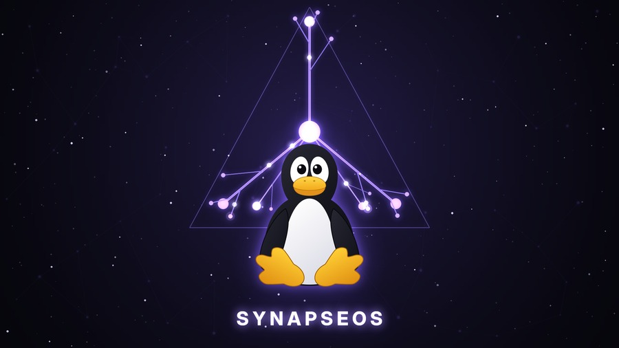

# SynapseOS — Dendrite & Tux

A Wallpaper Engine wallpaper: the SynapseOS dendrite mark firing behind Tux
over a glowing SYNAPSEOS lockup, as a seamless 10 s loop. Landscape
(1920x1080) and portrait (1080x1920) cuts, in two wordmark treatments.

## Why it is a *video* wallpaper

Wallpaper Engine has three project types and only one of them was open to us:

- **web** renders 100% black under `linux-wallpaperengine` — CEF initialises but
  the CEF→GL path hands back an all-black texture. Upstream bug, still open.
- **scene** needs its textures in Valve's proprietary `.tex` container and a
  scene graph authored by the Wallpaper Engine editor, which is Windows-only.
- **video** is just an H.264 file the engine hands to mpv. It works, and 22 of
  velle's subscribed video wallpapers already prove it on this seat.

So `make.py` draws 300 PNG frames with PIL and encodes them.

## Building

    ./make.py                  # 1920x1080 -> build/synapse-dendrite-tux.mp4
    ./make.py --portrait       # 1080x1920 -> build/synapse-dendrite-tux-portrait.mp4
    ./make.py --wordmark rgb   # the RGB cut -> build/synapse-dendrite-tux-rgb.mp4
    ./make.py --single 60      # just frame 60 -> build/…-still.png, ~0.6 s
    ./make.py --keep-frames    # leave build/frames-*/ behind

All four shipped files are the two orientations times the two wordmark modes;
`--wordmark` is part of the output basename, because purple and RGB are two
wallpapers under two Workshop ids rather than one wallpaper with a switch.

Needs `python3-pillow`, `rsvg-convert` (librsvg) and `ffmpeg`. The wordmark
wants Adwaita Sans (a variable font, so it can be asked for a weight of 760
that the OS ships no static cut of) and falls back to DejaVu Sans Bold, which
is on every Arch box.

`--single N` renders frame N of the **full-length** loop — `frames` stays the
period every animated quantity is derived from, and only the one frame is
drawn. It is also what produces `build/…-still.png`, the static cut for
swaybg/greeter use, so that still is exactly the frame the loop shows at N.

`build/` is **not** tracked (bar the preview JPEGs) — the render is
deterministic: fixed PRNG seeds, no clock input, no `random`, and fixed x264
settings. Verified, not assumed: re-rendering frames 60 and 217 from a clean
checkout reproduces the originals bit-for-bit. Re-run `make.py` rather than
committing 6 MB of derived video.

## Installing

    ./install.sh            # into the user's Steam Workshop tree
    ./install.sh --system   # into /usr/share/synapse/wallpapers/431960 (root)

These use ids `9000000001`–`9000000004`; Steam's real ids are file ids in the
1e9–4e9 range and never reach that block, so a subscription cannot land on top
of them. Steam does not garbage-collect ids it does not know about, but *verify
integrity* or a reinstall of Wallpaper Engine will take the user tree — that is
why `install.sh` exists and the packs are in the repo. The system tree is owned
by pacman and survives all of that.

### None of this needs Steam

That is worth stating plainly, because the opposite was assumed for a while.
`linux-wallpaperengine` is a package *we* build — it is the player, not Valve's
Windows app — and:

- the Workshop "content" directory **is just a directory**. Nothing about it
  requires Steam to have created it; `install.sh` `mkdir -p`s it.
- `--bg` takes a **path** as happily as an id. Verified: a wallpaper renders
  from `/usr/share/synapse/wallpapers/431960/<id>` with no Steam anywhere.
- Steam's 1.6 GB `wallpaper_engine/assets` tree is read by **scene** wallpapers
  only. These are video, and render with no `--assets-dir` at all. Also
  verified, by screenshotting one with the flag omitted.

So `synui-wpengine` searches the user's Workshop tree first and the system tree
second, and only refuses when a *scene* wallpaper needs assets that are absent.
An id in the user's tree is still handed over as a bare id, exactly as before;
only a system-tree wallpaper becomes a path, because the engine's own id lookup
searches Steam and nowhere else.

The static cut is a separate belt: `build/…-still.png` is installed as
`synui/data/wallpaper.png`, the fallback at `config.c:611`, so a stock install
shows this artwork with no player and no wallpaper package at all.

Then, per output:

    synui-wpengine set DP-1      9000000001    # landscape, purple wordmark
    synui-wpengine set HDMI-A-1  9000000002    # the rotated portrait monitor
    synui-wpengine set DP-1      9000000003    # landscape, RGB wordmark
    synui-wpengine set HDMI-A-1  9000000004    # portrait, RGB wordmark

`synui-wpengine` runs **one engine process per output** — overrides are global
inside a single process, so they cannot be scoped per screen. It drives the
engine with `--scaling fill`, which crops a 16:9 loop to its central ~31% of
width on the rotated monitor: that is what the portrait cut is for, and why
both cuts keep the mark and the penguin near the horizontal centre.

## How the loop closes

Every animated quantity has a period that divides `FRAMES`, so the last frame
hands over to the first with no seam:

| quantity                  | period          |
| ------------------------- | --------------- |
| pulses along the dendrite | `PULSE_CYCLE` (100) — 3 per loop |
| glow "breathing"          | `FRAMES/2` |
| Tux's bob                 | `FRAMES/3` |
| starfield drift           | `FRAMES` — exactly one canvas of travel |
| Tux's blink               | once, entirely inside the loop |
| the wordmark's hue sweep  | `FRAMES` — exactly one hue cycle |

Measured on the rendered frames, the wrap `f299 → f0` differs *less* than an
ordinary consecutive pair (mean 0.48 vs 0.56), so the handover is invisible.

## The mark

The dendrite geometry is lifted from `synui/data/logo.svg` in its own
coordinate space — soma at `(0, -48)` in a 1024x1024 box, the five canonical
branches as lines from it — so the mark on the wallpaper is the mark on the
Plymouth splash and the synui welcome emblem, just scaled. The palette
(`#a78bfa` on `#0a0a12`) is the same one.

The *secondary* arbor is invented: it exists so there is motion out where Tux
is not standing, and so the thing reads as a neuron rather than a logo pasted
on black.

## Tux

`assets/tux.svg` is drawn to Larry Ewing's proportions, not to a generic
penguin: a ~180-wide head over a ~292-wide body with the neck pinch at y=200,
eye whites that lean top-inward so a black wedge widens down to the bill, and
feet that are fat, wider than the body, and set apart with the body's black
bottom edge showing between them. Those are the things that carry the
likeness, and they are the first things an edit loses — the file says so at
the top.

The feet are the one part that is **generated** rather than hand-drawn. Two
hand-authored attempts came out as long thin fingers, so the outline is the
boundary of a union of discs — a heel disc plus three tapered stacks — which
makes "how fat is a toe" and "how deep is the web" independent numbers instead
of twelve control points. The generator is not in the build path; it produced
the `#tux-foot` path once and that path is now the asset.

Tux's blink is drawn *blind*: `render()` paints two lids over where it thinks
the eye whites are, from fractions of the 420x520 viewBox. Those fractions
have to track the SVG. A stale copy just paints two dark blobs beside his
eyes.

## Files

    make.py                    the renderer
    assets/tux.svg             Tux, in the flat SynapseOS palette
    pack/<id>/project.json     Wallpaper Engine project manifests
    install.sh                 copies build output + manifests into the Workshop tree
    build/                     derived, untracked
